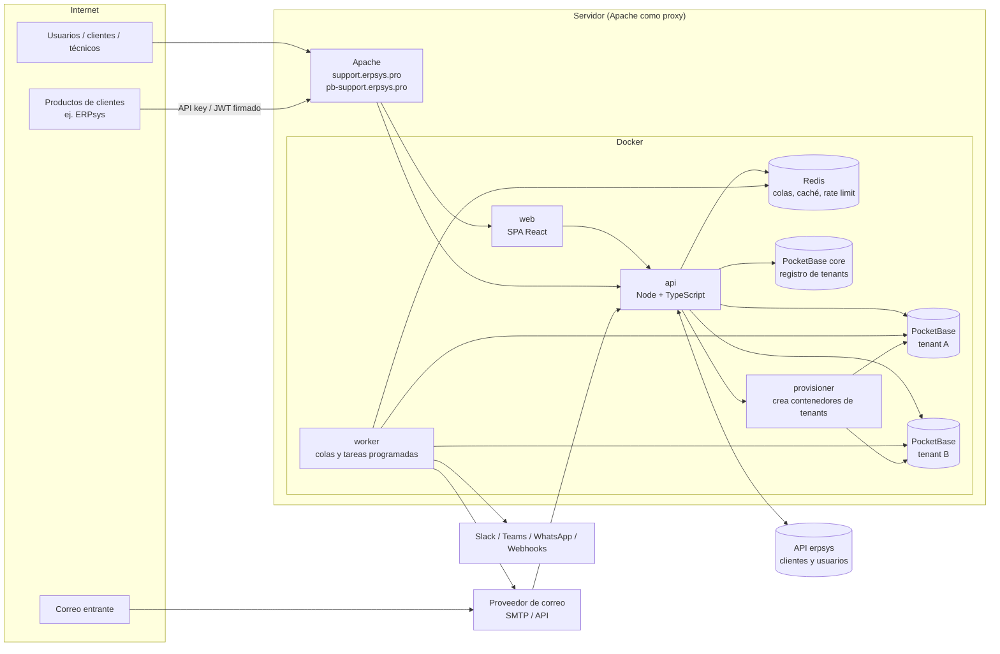
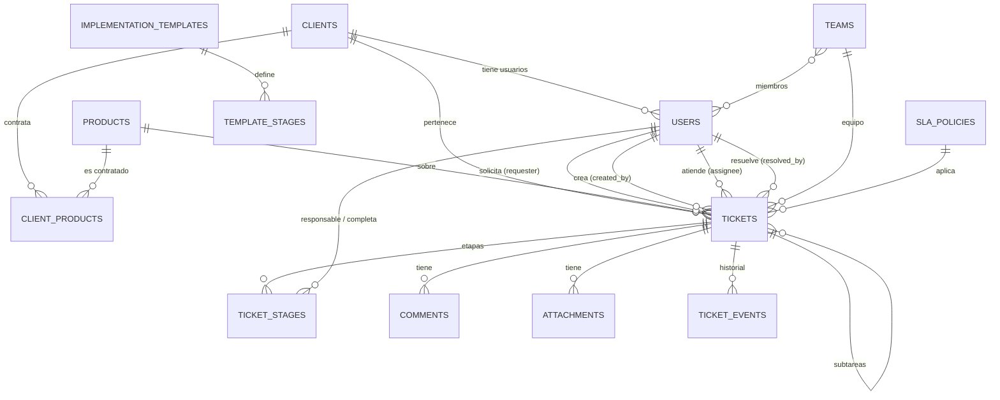
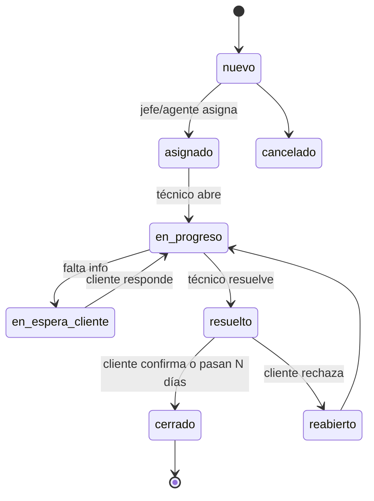

# Helpdesk v2 — Visión, arquitectura, MVP y roadmap

> Proyecto nuevo, independiente del helpdesk actual. Vive en la carpeta `v2/` del mismo repositorio
> hasta que decidamos reemplazar la versión actual.
>
> - App: https://support.erpsys.pro
> - Base de datos (PocketBase, consola): https://pb-support.erpsys.pro/_/
> - Todo corre en contenedores Docker; Apache del servidor solo hace de proxy hacia los contenedores.

---

## 1. Visión

Una plataforma de soporte e implementación **multi-empresa (multi-tenant)** que conecta a tres mundos:

1. **La empresa que vende software/servicios** (el *tenant*, ej. Seraph Systems): su dueño, jefes y técnicos.
2. **Sus clientes** (empresas que compraron un servicio, ej. Cap World).
3. **Los usuarios finales** de esos clientes, que usan el software y reportan problemas.

Con ella:

- El jefe asigna **tareas** e **implementaciones** a los técnicos y ve el avance en tiempo real.
- El cliente ve el progreso de su implementación etapa por etapa.
- Los usuarios reportan **bugs/errores** con tickets de soporte (texto, imágenes, videos, documentos) y el equipo técnico los recibe al instante.
- Todos se mantienen informados por **correo** (y luego otros canales) y pueden comentar el avance.
- Se obtienen **estadísticas**: qué técnico resuelve más, qué usuario/empresa reporta más, qué está atrasado y cuánto falta para terminar.
- Cada vez que se vende el servicio a una nueva empresa se **crea su propia base de datos** automáticamente.
- Funciona **solo** (aplicación web completa) o **como plugin** dentro de otros productos (widget, iframe, API, SDK).
- Toda la información externa (clientes, usuarios) llega **por APIs** (ej. erpsys) y los productos de los clientes pueden **crear tickets por API**.

---

## 2. Actores y roles

| Ámbito | Rol | Qué puede hacer |
|---|---|---|
| Plataforma | `super_admin` | Crear/suspender empresas (tenants), planes, ver uso global. |
| Empresa (tenant) | `owner` (dueño) | Todo dentro de su empresa: configuración, usuarios, integraciones, reportes. |
| Empresa | `manager` (jefe) | Asignar tickets/tareas/implementaciones, ver progreso y reportes de su equipo. |
| Empresa | `technician` (técnico) | Atender tickets asignados, marcar etapas, comentar, cambiar estados. |
| Empresa | `agent` (opcional, mesa de ayuda) | Clasificar y despachar tickets entrantes. |
| Cliente | `client_admin` | Ver todos los tickets e implementaciones de su empresa cliente, gestionar sus usuarios. |
| Cliente | `client_user` | Crear tickets de soporte, ver los suyos y el avance de las implementaciones de su empresa, comentar. |
| Cliente | `viewer` | Solo lectura del avance (ej. gerente del cliente). |
| Integración | `service_account` (API key) | Crear/consultar tickets desde otro sistema con permisos (*scopes*) limitados. |

Los permisos se modelan como **RBAC** (rol → permisos) más **reglas de alcance**: un usuario de cliente solo ve datos de su cliente; un técnico ve lo asignado a él o a su equipo (configurable).

---

## 3. Conceptos clave

- **Tenant**: empresa que compra el helpdesk. Tiene su propia base PocketBase.
- **Cliente**: empresa cliente del tenant. Puede venir de una API externa (erpsys).
- **Producto / servicio**: lo que el tenant vende (ej. "ERPsys", "Punto de venta"). Un cliente tiene uno o más productos contratados.
- **Ticket**: unidad de trabajo. Tipos:
  - `support` — reporte de error/bug/duda de un usuario.
  - `implementation` — proyecto para poner en marcha un servicio a un cliente; tiene **etapas**.
  - `task` — tarea interna asignada por el jefe a un técnico.
  - `request` — solicitud de cambio/mejora (opcional, fase 2).
- **Etapa**: paso de una implementación con fechas planificadas, responsable y estado.
- **Plantilla de implementación**: conjunto de etapas predefinidas con duración estimada para reutilizar.
- **SLA**: tiempos objetivo de primera respuesta y de resolución según prioridad.

---

## 4. Arquitectura



### 4.1 Multi-tenancy: una base de datos por empresa

- **PocketBase core** (`pb-core`): base central de la plataforma. Guarda tenants, planes, dominios, credenciales cifradas de cada base de tenant, trabajos de aprovisionamiento y métricas de uso. Es la que se ve en `https://pb-support.erpsys.pro/_/`.
- **PocketBase por tenant** (`pb-<slug>`): un contenedor y un volumen por empresa, con el mismo esquema (migraciones versionadas). Aislamiento total, respaldos y borrado por empresa, sin riesgo de mezclar datos.
- **Aprovisionamiento** (al vender el servicio), desde la consola de plataforma o un CLI:
  1. Registrar el tenant en core (nombre, slug, plan, correo del dueño).
  2. El *provisioner* crea el contenedor `pb-<slug>` con su volumen, en la red interna de Docker (sin puerto público).
  3. Aplica las migraciones del esquema del tenant y crea el superusuario (credenciales aleatorias, guardadas cifradas en core).
  4. Crea el usuario `owner`, la configuración inicial (estados, prioridades, SLA por defecto, plantilla de correo) y envía la invitación.
  5. Marca el tenant como `active`.
- **Resolución del tenant en cada petición**:
  - MVP: el usuario elige o escribe el código de su empresa al iniciar sesión; el JWT lleva `tenant_id`.
  - API externa: la API key identifica al tenant (prefijo `hk_<tenant>_...`).
  - Fase 2: subdominio por empresa (`<slug>.support.erpsys.pro`) con DNS y certificado comodín.
- **Pool de conexiones**: la API mantiene un cliente PocketBase autenticado por tenant (token de superusuario en caché, renovado automáticamente).
- **Migraciones**: un comando aplica las migraciones pendientes a todos los tenants (o a uno), con registro en core.
- **Consola de bases de tenants**: no se exponen públicamente. Para entrar a la consola de un tenant se usa un acceso temporal desde la consola de plataforma (o un túnel SSH). A validar: servirla en `pb-support.erpsys.pro/t/<slug>/_/`.

> Alternativa evaluada: una sola base con campo `tenant` en cada tabla. Es más simple, pero se descarta por el requisito de crear una base por empresa y por aislamiento/respaldos.

### 4.2 Por qué la API está en medio

El navegador y los productos externos **nunca hablan directo con PocketBase**: todo pasa por la API. Así centralizamos permisos, validaciones, auditoría, multi-tenancy, notificaciones e integraciones, y las bases de tenants quedan en la red interna. Las reglas de acceso de PocketBase se configuran igualmente como segunda línea de defensa.

---

## 5. Stack propuesto

| Capa | Tecnología | Motivo |
|---|---|---|
| Backend API | Node.js 22 + TypeScript + Fastify | Rápido, tipado, encaja con la estructura pedida (controllers, services, validators…). |
| Validación | Zod (esquemas compartidos con el frontend) | Un solo esquema para validar y tipar. |
| Base de datos | PocketBase (core + una por tenant) | Requisito; archivos, auth collections, *view collections* para estadísticas. |
| Colas y tareas | BullMQ + Redis | Correos, notificaciones, sincronizaciones, SLA, correo entrante. |
| Frontend | React + Vite + TypeScript, TanStack Query, dnd-kit | UI tipo ToDo/Kanban con arrastrar y soltar. |
| UI | Tailwind CSS + componentes accesibles (Radix/shadcn) | Interfaz amigable y consistente, modo claro/oscuro. |
| Gráficas | Apache ECharts o Recharts | Dashboards de estadísticas. |
| Correo | Nodemailer (SMTP) + plantillas MJML/Handlebars | Compatible con ZeptoMail, SES, Mailgun, etc. |
| Docs de API | OpenAPI 3 (generado desde los esquemas Zod) + Swagger UI | Para que los clientes integren sus productos. |
| Pruebas | Vitest + Supertest + Playwright | Unitarias, de API y de extremo a extremo. |
| Contenedores | Docker + Docker Compose | Requisito. Apache del host como proxy. |
| CI | GitHub Actions | Lint, pruebas, build de imágenes. |

---

## 6. Estructura del proyecto (monorepo dentro de `v2/`)

```
v2/
├── ROADMAP_MVP.md                 ← este documento
├── docker/
│   ├── docker-compose.yml         ← web, api, worker, redis, pb-core, provisioner
│   ├── docker-compose.prod.yml
│   └── docker-compose.dev.yml     ← + mailpit para probar correos
├── apps/
│   ├── api/
│   │   └── src/
│   │       ├── config/            ← variables de entorno validadas, constantes
│   │       ├── routes/            ← definición de rutas por módulo (v1, public, platform)
│   │       ├── controllers/       ← reciben la petición, llaman servicios, responden
│   │       ├── services/          ← lógica de negocio (tickets, etapas, SLA, reportes…)
│   │       ├── models/            ← repositorios sobre PocketBase y mapeo de colecciones
│   │       ├── middlewares/       ← auth JWT, tenant, RBAC, rate limit, errores, auditoría
│   │       ├── validators/        ← esquemas Zod de entrada
│   │       ├── types/             ← tipos de dominio y DTOs
│   │       ├── utils/             ← fechas hábiles, cifrado, paginación, logger
│   │       ├── tenancy/           ← resolución de tenant, pool de clientes PB, migraciones
│   │       ├── connectors/        ← fuentes externas: erpsys, CSV, genérico REST
│   │       ├── channels/          ← salida: email, webhook, slack, teams, whatsapp
│   │       ├── inbound/           ← entrada: correo (IMAP / webhook), API, widget
│   │       ├── events/            ← eventos de dominio (ticket.created, stage.completed…)
│   │       ├── jobs/              ← workers BullMQ y tareas programadas
│   │       ├── docs/              ← OpenAPI
│   │       └── server.ts / worker.ts
│   ├── web/
│   │   └── src/
│   │       ├── app/               ← router, layout, providers
│   │       ├── pages/             ← vistas
│   │       ├── features/          ← tickets, implementations, tasks, portal, admin, reports, platform
│   │       ├── components/        ← UI reutilizable
│   │       ├── hooks/ services/ stores/ types/ utils/ i18n/
│   └── widget/                    ← Web Component embebible <helpdesk-widget>
├── packages/
│   ├── shared/                    ← esquemas Zod y tipos compartidos api/web/sdk
│   └── sdk-js/                    ← SDK para integrar productos (luego sdk-php para erpsys)
├── pocketbase/
│   ├── Dockerfile
│   ├── core/pb_migrations/        ← esquema de la base central
│   └── tenant/
│       ├── pb_migrations/         ← esquema de cada empresa
│       └── pb_hooks/              ← numeración de tickets, validaciones de última línea
└── scripts/                       ← create-tenant, migrate-all, backup, seed-demo
```

Reglas: los `controllers` no tocan PocketBase directamente (pasan por `services` → `models`); los `validators` se ejecutan en `routes` antes del controlador; los `services` emiten `events` y los `jobs` reaccionan (notificaciones, métricas), así una petición no espera a que se envíe un correo.

---

## 7. Modelo de datos (PocketBase)

### 7.1 Base core (plataforma)

| Colección | Campos principales |
|---|---|
| `platform_users` (auth) | nombre, correo, rol `super_admin`, 2FA |
| `plans` | nombre, límites (usuarios, técnicos, GB de archivos, tickets/mes), precio |
| `tenants` | nombre, slug, estado (`provisioning`/`active`/`suspended`/`deleted`), plan → `plans`, correo del dueño, URL interna PB, contenedor, credenciales cifradas, versión de esquema |
| `tenant_domains` | tenant → `tenants`, dominio, verificado |
| `provisioning_jobs` | tenant, paso, estado, log, fechas |
| `usage_daily` | tenant, fecha, tickets creados, usuarios activos, almacenamiento |

### 7.2 Base de cada tenant

Todas las colecciones tienen `created` y `updated` automáticos. Las flechas indican relaciones.

| Colección | Campos principales |
|---|---|
| `users` (auth) | nombre, correo, teléfono, avatar, rol, cliente → `clients` (vacío si es personal interno), equipo(s) → `teams`, estado, idioma, zona horaria, `external_source`, `external_id`, último acceso |
| `teams` | nombre, líder → `users`, productos → `products` |
| `clients` | nombre, NIT/ID fiscal, estado, SLA → `sla_policies`, ejecutivo → `users`, `external_source`, `external_id` |
| `products` | código, nombre, descripción, activo |
| `client_products` | cliente → `clients`, producto → `products`, plan/licencia, vigencia |
| `tickets` | número (secuencial por tenant), tipo, título, descripción, estado, prioridad, severidad, producto, cliente, **solicitante** → `users`, **creado por** → `users`, **asignado a** → `users`, equipo → `teams`, **resuelto por** → `users`, cerrado por → `users`, canal (`web`/`email`/`api`/`widget`), referencia externa, ticket padre → `tickets`, plantilla, SLA, vencimientos (primera respuesta, resolución), fechas de primera respuesta / resuelto / cerrado, observadores → `users` (múltiple), etiquetas |
| `ticket_stages` | ticket, nombre, orden, descripción, estado, responsable → `users`, inicio y fin planificados, inicio y fin reales, **completada por** → `users`, peso (para el % de avance), visible al cliente (sí/no) |
| `implementation_templates` / `template_stages` | nombre, producto; etapas con orden, duración estimada en días hábiles, rol responsable sugerido |
| `comments` | ticket, etapa (opcional), autor → `users`, cuerpo, visibilidad (`public`/`internal`), origen (`web`/`email`/`api`) |
| `attachments` | ticket, comentario, etapa, archivo (imágenes, videos, PDF, Office, zip), tipo MIME, tamaño, subido por → `users` |
| `ticket_events` | ticket, actor → `users`, tipo (`status_changed`, `assigned`, `stage_completed`, `comment_added`…), valor anterior, valor nuevo, metadatos JSON |
| `sla_policies` / `business_calendars` | metas por prioridad; horario laboral y feriados |
| `notification_rules` | evento, destinatarios (solicitante, admin del cliente, asignado, equipo, jefe, observadores), canales, plantilla |
| `notification_channels` | tipo (`email`, `webhook`, `slack`, `teams`, `whatsapp`, `telegram`), configuración cifrada |
| `notifications` (outbox) | evento, destinatario, canal, estado (`pending`/`sent`/`failed`), intentos, error |
| `user_notification_prefs` | usuario, evento, canales activos, resumen diario |
| `inbound_mailboxes` | dirección, tipo (IMAP / webhook del proveedor), credenciales cifradas, producto y equipo por defecto |
| `email_threads` | Message-ID ↔ ticket, para que las respuestas por correo se agreguen como comentarios |
| `integrations` | tipo (`erpsys`, `rest`, `csv`), URL, credenciales cifradas, mapeo de campos, frecuencia de sincronización |
| `sync_runs` | integración, inicio, fin, creados, actualizados, errores |
| `api_keys` | nombre, hash, prefijo, scopes, cliente (opcional), expiración, último uso |
| `webhooks` / `webhook_deliveries` | URL, eventos, secreto de firma; entregas con estado y reintentos |
| `sessions` | usuario, hash del refresh token, IP, user agent, expiración, revocado |
| `audit_logs` | actor, acción, entidad, id, IP, cambios JSON |
| `canned_responses` | respuestas rápidas para técnicos |
| `settings` | marca (logo, colores), idioma por defecto, estados personalizados, límites de archivos |
| *Vistas de estadísticas* | `stats_by_technician`, `stats_by_requester`, `stats_by_client`, `stats_overdue`, `stats_implementation_progress` (view collections con SQL `GROUP BY`) |



---

## 8. Estados y flujos

### Ticket de soporte



Al crear el ticket, el sistema registra automáticamente **fecha, hora, usuario, cliente, producto y canal**; el usuario solo debe escribir el **título** y, si quiere, descripción y adjuntos (imágenes, videos, documentos).

### Implementación

- Estados: `planificada` → `en_curso` → `en_pausa` ↔ `en_curso` → `completada` (o `cancelada`).
- Etapas: `pendiente` → `en_curso` → `completada` (también `bloqueada` y `omitida`).
- Al crearla desde una plantilla, las fechas de cada etapa se calculan con días hábiles a partir de la fecha de inicio.
- **Avance** = suma de pesos de etapas completadas / suma total.
- **Etapa atrasada**: fin planificado < hoy y no completada.
- **Fecha estimada de término**: fin planificado de la última etapa + retraso acumulado actual; se muestra "faltan X días hábiles" o "atrasada X días".
- Al completar una etapa se puede exigir evidencia (archivo o comentario).

### Tarea interna

`pendiente` → `en_progreso` → `hecha` (vista tipo ToDo, con fecha límite y prioridad).

---

## 9. Seguridad

- **Autenticación**: JWT de acceso de corta duración (15 min, firmado con clave asimétrica y rotación de claves) + **refresh token** rotativo en cookie `httpOnly`, `Secure`, `SameSite`, guardado con hash en `sessions` (revocable, cierre de sesión en todos los dispositivos).
- **Proveedores de login**: local (contraseña), **delegado a erpsys** (valida la contraseña contra la API del ERP), y más adelante OAuth (Google/Microsoft) y SSO por JWT firmado desde productos externos (para el modo plugin).
- **Contraseñas**: hash fuerte (bcrypt/argon2), políticas mínimas, recuperación por enlace de un solo uso.
- **Protección de login**: límite de intentos por IP y por cuenta, bloqueo temporal, CAPTCHA tras varios fallos, alertas de inicio de sesión nuevo.
- **2FA (TOTP)** obligatorio para `super_admin` y opcional para el personal (fase 2).
- **Autorización**: RBAC + alcance por cliente/equipo en cada servicio, y reglas de PocketBase como segunda capa.
- **API keys**: guardadas con hash, prefijo visible, scopes, expiración, límite de peticiones por key, rotación.
- **Webhooks**: firmados con HMAC y marca de tiempo.
- **Archivos**: validación de tipo y tamaño, URLs firmadas de corta duración, antivirus (ClamAV) en fase 2.
- **Secretos**: credenciales de integraciones y bases cifradas (AES-256-GCM) con clave maestra fuera de la base.
- **Red**: PocketBase de tenants sin puertos públicos; consola core con restricción por IP; HTTPS con HSTS; CORS por tenant (dominios permitidos para el widget); cabeceras de seguridad.
- **Auditoría**: registro de acciones sensibles (permisos, borrados, exportaciones, accesos de plataforma).
- **Respaldos**: copia diaria por tenant (respaldos de PocketBase hacia almacenamiento S3 compatible) con retención y prueba de restauración.

---

## 10. Integraciones y APIs

### 10.1 Consumir APIs externas (clientes y usuarios)

Patrón **conector**: cada fuente implementa la misma interfaz (`listClients`, `listUsers`, `lookupUser`, `authenticate`, `listProducts`).

- **Conector erpsys** (primero): empresas, usuarios, licencias, autenticación delegada.
- Conector **REST genérico** configurable (URL, autenticación, mapeo de campos) y **importación CSV**.
- Modos de sincronización: al vuelo (JIT, al iniciar sesión o registrarse), programada (cada N minutos), y por webhook desde la fuente.
- Cada registro sincronizado guarda `external_source` + `external_id` para evitar duplicados.

### 10.2 Exponer APIs (para que los productos creen tickets)

- `POST /public/v1/tickets` crear ticket (con adjuntos), `GET /public/v1/tickets/{ref}` estado, `POST /public/v1/tickets/{ref}/comments`, `GET /public/v1/tickets?requester=...`.
- Autenticación con **API key** del tenant; opcionalmente "en nombre de" un usuario (se crea o vincula por correo/ID externo).
- **Idempotencia** con cabecera `Idempotency-Key` y referencia externa.
- **Webhooks salientes**: `ticket.created`, `ticket.status_changed`, `ticket.assigned`, `comment.created`, `stage.completed`, `implementation.completed`.
- Documentación OpenAPI pública y colección de ejemplos.

### 10.3 Modo plugin

1. **Widget embebible** (`<script>` + `<helpdesk-widget>`): botón "Reportar problema" dentro del producto del cliente (ej. erpsys) para crear tickets y ver "mis tickets". Captura automática de URL, navegador y captura de pantalla opcional.
2. **SSO por token firmado**: el producto anfitrión firma un JWT con el secreto del tenant (usuario, correo, cliente); el helpdesk confía y crea o vincula al usuario sin otra contraseña.
3. **Portal en iframe** con el mismo SSO.
4. **SDKs**: JavaScript/TypeScript y PHP (para erpsys).

### 10.4 API interna (la usa el frontend)

`/api/v1/auth/*`, `/api/v1/me`, `/api/v1/tickets` (+ `/comments`, `/attachments`, `/assign`, `/status`), `/api/v1/implementations` (+ `/stages/{id}/complete`), `/api/v1/tasks`, `/api/v1/clients`, `/api/v1/users`, `/api/v1/products`, `/api/v1/templates`, `/api/v1/reports/*`, `/api/v1/integrations/*`, `/api/v1/settings`, y `/platform/v1/tenants` solo para `super_admin`.

---

## 11. Notificaciones y canales

### Salida

- Eventos de dominio → **reglas de notificación** → destinatarios → canales → **outbox** con reintentos.
- Destinatarios típicos: solicitante, admin del cliente, técnico asignado, equipo, jefe, observadores.
- Eventos: ticket creado, asignado, cambio de estado, comentario público, etapa completada, etapa atrasada, implementación completada, SLA por vencer / vencido, resumen diario para jefes.
- Canales: **correo** (MVP), webhooks (fase 2), Slack/Teams/Telegram/WhatsApp (fase 3).
- Preferencias por usuario (qué recibir y por dónde) y plantillas por tenant con su marca e idioma.
- Los correos de etapas de una implementación pueden limitarse al contacto principal del cliente (configurable por regla).

### Entrada (correo → ticket)

- Buzón por tenant (ej. `soporte@empresa.com`) leído por **IMAP** o por **webhook de correo entrante** del proveedor.
- Correo nuevo → se busca al usuario por remitente (o se crea como contacto del cliente según su dominio) → se crea el ticket con los adjuntos.
- Respuesta a un correo del helpdesk → se agrega como comentario al ticket correcto (por `Message-ID`/`In-Reply-To` o `[#TCK-123]` en el asunto).
- Filtros anti-bucle (respuestas automáticas, rebotes) y lista de remitentes bloqueados.

---

## 12. Estadísticas y reportes

- **Técnicos**: tickets resueltos, tiempo medio de primera respuesta y de resolución, cumplimiento de SLA, carga actual, etapas completadas.
- **Usuarios**: quién levanta más tickets, por tipo y producto.
- **Empresas cliente**: qué empresa levanta más tickets, por producto, tendencia mensual.
- **Atrasos**: tickets vencidos (SLA), tickets sin asignar, implementaciones con etapas atrasadas, días de retraso y fecha estimada de término.
- **Implementaciones**: % de avance, etapas por estado, tiempo real vs planificado por etapa (para mejorar las plantillas).
- Filtros por período, producto, cliente, equipo y técnico; exportación CSV/Excel; envío programado por correo.
- Implementación técnica: *view collections* de PocketBase con SQL de agregación + instantáneas diarias (`metrics_daily`) para gráficas rápidas.

---

## 13. Interfaz

- **Mi día (tipo ToDo)**: lista para técnicos agrupada en *Atrasado / Hoy / Próximo / Sin fecha*, con casillas para completar tareas y etapas, prioridad por colores, alta rápida con una línea, atajos de teclado.
- **Tablero Kanban**: columnas por estado con arrastrar y soltar, filtros por producto, cliente, técnico y prioridad, vistas guardadas.
- **Detalle de ticket**: panel lateral con datos, conversación (pública/interna), adjuntos con vista previa (imágenes y video), historial, botones de acción claros (Asignar, Iniciar, Resolver).
- **Implementaciones**: línea de tiempo/Gantt de etapas, barra de avance, "faltan X días", responsables por etapa.
- **Panel del jefe**: carga por técnico, asignación por arrastre, atrasos, KPIs.
- **Portal del cliente**: crear ticket en un paso (título + adjuntos opcionales), mis tickets, avance de implementaciones de su empresa, comentarios.
- **Administración**: usuarios y roles, empresas cliente y sus usuarios, productos, equipos, plantillas, SLA, canales, buzones, integraciones, API keys, marca.
- **Consola de plataforma** (super admin): alta de empresas con aprovisionamiento automático, planes, estado y uso.
- Responsive (usable en celular), modo claro/oscuro, español/inglés/portugués.

---

## 14. Despliegue (Docker)

| Contenedor | Función | Exposición |
|---|---|---|
| `web` | SPA compilada servida con Nginx; envía `/api` a `api` | 127.0.0.1:puerto → Apache `support.erpsys.pro` |
| `api` | API REST | solo red interna (vía `web`) |
| `worker` | colas, correos, SLA, sincronizaciones, correo entrante | interna |
| `redis` | colas, caché, rate limit | interna |
| `pb-core` | base de plataforma | 127.0.0.1:puerto → Apache `pb-support.erpsys.pro` (restringir por IP) |
| `pb-<slug>` | una por empresa, creada por el provisioner | interna |
| `provisioner` | crea/borra contenedores de tenants mediante un proxy restringido del socket de Docker | interna |
| `mailpit` (solo dev) | bandeja de correo de prueba | local |

- Apache del host solo hace `ProxyPass` con HTTPS (Let's Encrypt) hacia los contenedores, como hoy.
- Volúmenes por base de datos; respaldos diarios a almacenamiento externo.
- Imágenes construidas en CI; despliegue con `docker compose up -d --build`.
- Mientras se construye, v2 puede correr en puertos propios y un subdominio de pruebas; al terminar el MVP se cambian los vhosts de `support` y `pb-support` hacia v2 (ver decisiones pendientes).

---

## 15. MVP

**Objetivo**: que Seraph Systems (primer tenant) atienda soporte e implementaciones de sus clientes de erpsys en v2, con datos de clientes y usuarios traídos por API, y que se pueda dar de alta una segunda empresa con su propia base en minutos.

### Incluye

1. **Multi-tenant**: PocketBase core + aprovisionamiento automático de la base de cada empresa (CLI y pantalla básica en la consola de plataforma), migraciones versionadas.
2. **Autenticación y roles**: login con JWT + refresh token, recuperación de contraseña, login delegado a erpsys, límite de intentos; roles `super_admin`, `owner`, `manager`, `technician`, `client_admin`, `client_user`.
3. **Administración**: usuarios y roles, empresas cliente, productos, equipos; **sincronización de clientes y usuarios desde erpsys** (manual y programada).
4. **Tickets de soporte**: alta con solo título (fecha, hora, usuario, cliente registrados automáticamente), descripción, adjuntos (imágenes, videos, documentos con límite de tamaño), estados, prioridad, producto, asignación, comentarios públicos/internos, historial.
5. **Implementaciones**: creación desde plantilla con etapas y fechas en días hábiles, responsable por etapa, completar etapa (con evidencia opcional), % de avance, etapas atrasadas, fecha estimada de término; visible para dueño, jefe, técnicos y usuarios del cliente.
6. **Tareas internas** asignadas por el jefe con fecha límite.
7. **Interfaz**: Mi día (ToDo), Kanban, detalle de ticket, vista de implementación, portal del cliente, pantallas de administración.
8. **Notificaciones por correo**: ticket creado, asignado, cambio de estado, comentario público, etapa completada, implementación completada; plantillas con la marca del tenant.
9. **API pública v1** con API keys: crear ticket (con adjuntos), consultar estado, comentar; documentación OpenAPI.
10. **Dashboard básico**: contadores, tickets vencidos, implementaciones atrasadas con fecha estimada, top técnicos, top usuarios y top empresas (últimos 30 días).
11. **Infraestructura**: todo en Docker, publicado en `support.erpsys.pro` y `pb-support.erpsys.pro`, respaldos diarios, logs centralizados.

### No incluye (pasa a fases siguientes)

Correo entrante → ticket, SLA con horario laboral, widget/plugin y SSO por token, webhooks salientes, 2FA, Slack/Teams/WhatsApp, base de conocimiento, encuestas de satisfacción, subdominio por tenant, facturación.

### Criterios de aceptación

- Crear la empresa "Demo S.A." desde la consola deja lista su base, su dueño recibe la invitación y puede entrar en menos de 5 minutos, sin pasos manuales en el servidor.
- Un usuario de erpsys se registra con su seraph_id y correo, entra con su contraseña del ERP y queda vinculado a su empresa cliente.
- Un usuario crea un ticket escribiendo solo el título; el ticket guarda fecha, hora, usuario y cliente, y el equipo técnico recibe el correo.
- El jefe crea una implementación desde una plantilla, asigna técnicos por etapa; cada técnico marca su etapa y el jefe y los usuarios del cliente ven el % de avance y la fecha estimada.
- Un usuario de un cliente nunca ve tickets de otro cliente ni de otra empresa (pruebas automáticas de aislamiento).
- Un sistema externo crea un ticket por la API con su API key y consulta su estado.
- El dashboard muestra top técnicos, top usuarios, top empresas y la lista de atrasados con datos correctos.

---

## 16. Roadmap

Estimaciones para un equipo de 1–2 desarrolladores; se ajustan al confirmar el alcance.

| Fase | Duración estimada | Contenido |
|---|---|---|
| **0. Fundaciones** | 2 semanas | Monorepo, Docker Compose, CI, PocketBase core y esquema de tenant con migraciones, provisioner, estructura de la API (config, routes, controllers, services, models, middlewares, validators, types, utils), auth JWT, RBAC base, layout del frontend. |
| **1. MVP** | 6–8 semanas | Todo lo de la sección 15, en este orden: tenants y auth → clientes/usuarios/productos y conector erpsys → tickets de soporte y adjuntos → implementaciones y etapas → UI ToDo/Kanban/portal → correos → API pública → dashboard → endurecimiento y despliegue. |
| **2. v1.0 operación completa** | 4–6 semanas | Correo entrante → ticket y respuestas por correo, SLA con horario laboral y escalamiento, widget embebible y SSO por token (modo plugin), SDK JS/PHP, webhooks salientes, 2FA, subdominio por tenant, reportes avanzados con exportación y envío programado, antivirus de adjuntos. |
| **3. Canales y experiencia** | 4–6 semanas | Slack, Microsoft Teams, Telegram, WhatsApp Business; base de conocimiento con sugerencias al crear ticket; encuestas de satisfacción (CSAT); respuestas rápidas; PWA con notificaciones push; Gantt editable. |
| **4. Inteligencia** | continuo | Clasificación y prioridad sugeridas por IA, detección de duplicados, resumen de conversaciones, respuesta sugerida, predicción de retrasos en implementaciones. |
| **5. Negocio y escala** | continuo | Planes y facturación automática, límites por plan, autoservicio de alta de empresas, varios servidores para bases de tenants, marketplace de conectores, dominios propios por empresa (`soporte.cliente.com`). |

---

## 17. Ideas adicionales

- **Portal público de estado** del servicio (incidentes y mantenimientos) por producto.
- **Tickets relacionados y problemas maestros**: agrupar muchos reportes del mismo bug en un incidente.
- **Control de tiempo** por ticket/etapa (horas trabajadas) para costos e informes al cliente.
- **Aprobaciones**: el cliente aprueba la entrega de una etapa de implementación.
- **Checklists** dentro de cada etapa.
- **Contratos y bolsas de horas** por cliente con alertas de consumo.
- **Encuesta al cerrar** y NPS por empresa cliente.
- **Modo offline/PWA** para técnicos en campo.
- **Importador** desde el helpdesk actual (tickets, comentarios, adjuntos) para migrar sin perder historial.

---

## 18. Riesgos y mitigaciones

| Riesgo | Mitigación |
|---|---|
| Muchas empresas = muchos contenedores PocketBase (memoria) | Medir consumo por tenant, límites de memoria por contenedor, plan para repartir tenants en varios servidores. |
| Migraciones de esquema en muchas bases | Migraciones versionadas e idempotentes, ejecución por lotes con registro en core y reversión. |
| PocketBase no tiene consultas de agregación por API | Usar *view collections* con SQL y métricas diarias precalculadas. |
| Dependencia de la API de erpsys | Caché local de clientes/usuarios, reintentos, y el login delegado degrada con mensaje claro si el ERP no responde. |
| Correos que no llegan (SPF/DKIM) | Proveedor transaccional, dominios verificados por tenant, monitoreo de rebotes. |
| Seguridad del socket de Docker en el provisioner | Proxy de socket con permisos mínimos, provisioner aislado y sin exposición. |
| Alcance grande | MVP estricto, entregas cada 2 semanas con demo. |

---

## 19. Decisiones pendientes

1. **Stack del backend**: Node.js + TypeScript (propuesto) o Go.
2. **Cuándo ocupar `support.erpsys.pro`**: desde ya (reemplazando el helpdesk actual) o al terminar el MVP, usando mientras tanto un subdominio de pruebas.
3. **Proveedor de correo** (ZeptoMail, SES, Mailgun…) y dominio remitente por tenant.
4. **Límites de adjuntos** (tamaño máximo de video, almacenamiento por plan) y si se usa almacenamiento S3 externo.
5. **Primer conjunto de estados** (fijos o configurables por tenant desde el MVP).
6. **Migración de datos** del helpdesk actual a v2 o empezar limpio.
