# Helpdesk v2 — Visión, arquitectura, MVP y roadmap

> Proyecto nuevo, independiente del helpdesk actual. Vive en la carpeta `v2/` del mismo repositorio
> hasta que decidamos reemplazar la versión actual.
>
> **Nuestra instancia (Seraph Systems / erpsys):**
> - Programa: https://support.erpsys.pro/
> - Base de datos (consola PocketBase): https://pb-support.erpsys.pro/_/#/
>
> **Cada empresa a la que se le venda** tendrá su propia instancia completa (programa + base de datos)
> en su propio dominio, por ejemplo `https://support.empresa.com/` y `https://pb-support.empresa.com/_/`.
>
> Todo corre en contenedores Docker; Apache del servidor solo hace de proxy hacia los contenedores.
> Toda la aplicación está traducida a **español, inglés y portugués**, con **modo claro/oscuro** y
> **temas de color** (base visual de erpsys en tonos azules).

---

## 1. Visión

Una plataforma de soporte e implementación **multi-empresa (multi-tenant)** que conecta a tres mundos:

1. **La empresa que vende software/servicios** (el *tenant*, ej. Seraph Systems): su dueño, jefes y técnicos.
2. **Sus clientes** (empresas que compraron un servicio, ej. Cap World).
3. **Los usuarios finales** de esos clientes, que usan el software y reportan problemas.

Con ella:

- El jefe asigna **tareas** e **implementaciones** a los técnicos y ve el avance en tiempo real.
- El cliente ve el progreso de su implementación etapa por etapa y **se entera de todo**; cuando necesitamos algo de él (información, documentos, accesos, aprobaciones) se le pide formalmente, se le recuerda y, al entregarlo, la implementación avanza a la siguiente etapa.
- Soporte, implementación, tarea y cualquier tipo nuevo de caso viven en un **modelo de datos normalizado y configurable**, sin crear tablas nuevas por cada tipo.
- Los usuarios reportan **bugs/errores** con tickets de soporte (texto, imágenes, videos, documentos) y el equipo técnico los recibe al instante.
- Todos se mantienen informados por **correo** (y luego otros canales) y pueden comentar el avance.
- Se obtienen **estadísticas**: qué técnico resuelve más, qué usuario/empresa reporta más, qué está atrasado y cuánto falta para terminar.
- Cada vez que se vende el servicio a una nueva empresa se **crea su propia instancia**: su programa y su base de datos, corriendo en **su propio dominio**, de forma automática.
- Interfaz en **español, inglés y portugués**, con **modo claro/oscuro** y **cambio de color de tema**.
- Funciona **solo** (aplicación web completa) o **como plugin** dentro de otros productos (widget, iframe, API, SDK).
- Toda la información externa (clientes, usuarios) llega **por APIs** (ej. erpsys) y los productos de los clientes pueden **crear tickets por API**.
- Trabaja **de la mano con erpsyschat** como microservicios: una conversación de chat se convierte en ticket y el usuario recibe los avisos del ticket en el chat. Se puede conectar a otros sistemas y canales con conectores.
- **Configuración fácil por empresa** (correo desde el que se envía todo, marca, idioma, integraciones) desde un asistente, sin tocar código.

---

## 2. Actores y roles

| Ámbito | Rol | Qué puede hacer |
|---|---|---|
| Plataforma (nosotros) | `platform_operator` | Crear, actualizar, respaldar y suspender instancias de empresas desde la consola de instancias. No entra a los datos de una empresa salvo acceso de soporte autorizado y auditado. |
| Empresa (instancia) | `owner` (dueño) | Todo dentro de su instancia: configuración, marca, usuarios, integraciones, reportes. |
| Empresa | `manager` (jefe) | Asignar tickets/tareas/implementaciones, ver progreso y reportes de su equipo. |
| Empresa | `technician` (técnico) | Atender tickets asignados, marcar etapas, comentar, cambiar estados. |
| Empresa | `agent` (opcional, mesa de ayuda) | Clasificar y despachar tickets entrantes. |
| Cliente | `client_admin` | Ver todos los tickets e implementaciones de su empresa cliente, gestionar sus usuarios. |
| Cliente | `client_user` | Crear tickets de soporte, ver los suyos y el avance de las implementaciones de su empresa, comentar. |
| Cliente | `viewer` | Solo lectura del avance (ej. gerente del cliente). |
| Integración | `service_account` (API key) | Crear/consultar tickets desde otro sistema con permisos (*scopes*) limitados. |

Los permisos se modelan como **RBAC** (rol → permisos) más **reglas de alcance**: un usuario de cliente solo ve datos de su cliente; un técnico ve lo asignado a él o a su equipo (configurable).

---

## 3. Conceptos clave

- **Tenant / instancia**: empresa que compra el helpdesk. Tiene su propia instalación completa (programa, base PocketBase, colas) en su propio dominio.
- **Cliente**: empresa cliente del tenant. Puede venir de una API externa (erpsys).
- **Producto / servicio**: lo que el tenant vende (ej. "ERPsys", "Punto de venta"). Un cliente tiene uno o más productos contratados.
- **Caso (work item)**: unidad de trabajo única para todo. Soporte, implementación, tarea y cualquier tipo futuro son **la misma entidad** con un **tipo** distinto; en pantalla se muestra con el nombre de su tipo ("Ticket de soporte", "Implementación"…).
- **Tipo de caso**: configurable por cada empresa, sin programar. Vienen de fábrica:
  - `support` — reporte de error, bug o duda de un usuario.
  - `implementation` — proyecto para poner en marcha un servicio a un cliente; tiene **etapas**.
  - `task` — tarea interna asignada por el jefe a un técnico.
  - Ejemplos que la empresa puede agregar: solicitud de cambio, capacitación, migración de datos, incidente, visita en sitio, renovación.
  Cada tipo define su flujo de estados, si tiene etapas, sus campos adicionales, su prefijo de numeración y si el cliente lo ve.
- **Flujo de estados (workflow)**: estados y transiciones permitidas de un tipo. Cada estado pertenece a una **categoría fija** (nuevo, abierto, en progreso, esperando cliente, esperando interno, resuelto, cerrado, cancelado) para que reportes y SLA funcionen igual con cualquier tipo.
- **Etapa**: paso de un caso con etapas (ej. una implementación), con fechas, responsable, **de quién depende** (nuestro equipo, el cliente o ambos) y dependencias con otras etapas.
- **Requerimiento al cliente**: algo que necesitamos del cliente para avanzar (información, documento, carga de datos, accesos, aprobación, reunión). Tiene responsable del lado del cliente, fecha límite, recordatorios y revisión; si es bloqueante, la etapa no avanza hasta que se acepte.
- **Plantilla**: conjunto reutilizable de etapas, requerimientos al cliente y checklists para un tipo de caso (ej. "Implementación ERPsys estándar").
- **SLA**: tiempos objetivo de primera respuesta y de resolución según tipo, prioridad y cliente; se pausa mientras se espera al cliente.

---

## 4. Arquitectura

### 4.1 Modelo multi-empresa: una instancia completa por empresa, en su dominio

Cada empresa que compra el producto recibe **su propia instancia**: su programa, su base de datos PocketBase, sus colas y sus archivos, publicados en **su propio dominio**. Ninguna empresa comparte base ni proceso con otra.

| Empresa | Programa | Base de datos (consola) |
|---|---|---|
| Seraph Systems (nosotros) | `https://support.erpsys.pro/` | `https://pb-support.erpsys.pro/_/#/` |
| Empresa A | `https://support.empresa-a.com/` | `https://pb-support.empresa-a.com/_/` |
| Empresa B | `https://soporte.empresa-b.com/` | `https://pb-soporte.empresa-b.com/_/` |

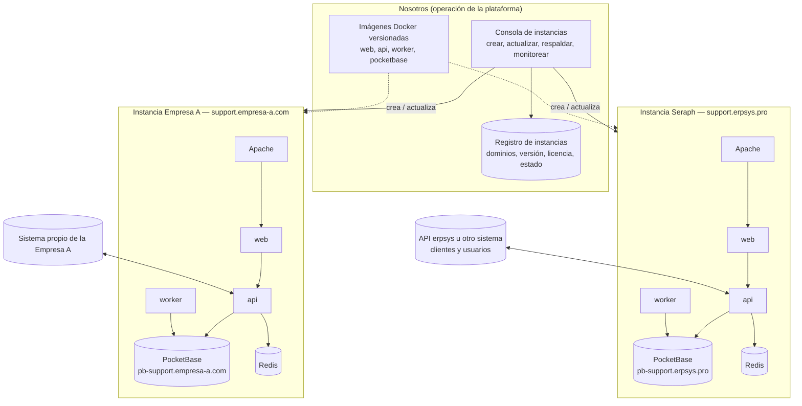

**Cómo se crea una instancia al vender el producto** (consola de instancias o CLI `create-instance`):

1. Datos de entrada: nombre de la empresa, dominio del programa y de la base (ej. `support.empresa-a.com` y `pb-support.empresa-a.com`), correo del dueño, idioma y tema por defecto, servidor destino.
2. Requisito previo: la empresa apunta sus registros DNS (A o CNAME) al servidor. La consola verifica que resuelvan antes de seguir.
3. Se genera un proyecto Docker Compose propio (`helpdesk-<slug>`) con su `.env`, secretos aleatorios, volúmenes y puertos internos libres.
4. Se crean los vhosts de Apache para ambos dominios con proxy hacia los contenedores, y los certificados HTTPS con Let's Encrypt.
5. Se levantan los contenedores, se aplican las migraciones del esquema, se crea el superusuario de PocketBase y el usuario `owner` con su invitación por correo.
6. Se carga la configuración inicial: estados, prioridades, SLA por defecto, plantillas de correo, idioma, tema y logo.
7. Se registra la instancia (dominios, versión, servidor, estado) y queda `active`.

**Operación de todas las instancias:**

- **Actualizaciones**: todas usan las mismas imágenes versionadas (`helpdesk-api:1.4.0`, etc.). Actualizar = cambiar la versión, aplicar migraciones y verificar salud; por lotes o una a una, con reversión.
- **Respaldos**: diarios por instancia (respaldo de PocketBase + archivos) hacia almacenamiento externo.
- **Monitoreo**: estado de salud, versión, espacio en disco y errores de cada instancia en la consola.
- **Ubicación flexible**: una instancia puede correr en nuestro servidor o en el servidor del cliente (*on-premise*) con las mismas imágenes.
- **Licencia**: cada instancia tiene una licencia (plan, límites, vencimiento) que valida contra el registro.
- **Soporte**: si hace falta entrar a una instancia de un cliente, se usa un acceso temporal, autorizado por el dueño y auditado.

> Ventajas de este modelo: aislamiento total de datos, cada empresa con su dominio y su marca, respaldos y borrado independientes, y la posibilidad de instalarlo en el servidor del cliente. El costo es operar varias instancias, por eso la consola de instancias, las imágenes versionadas y las migraciones automáticas son parte del diseño desde el inicio.

### 4.2 Arquitectura dentro de una instancia

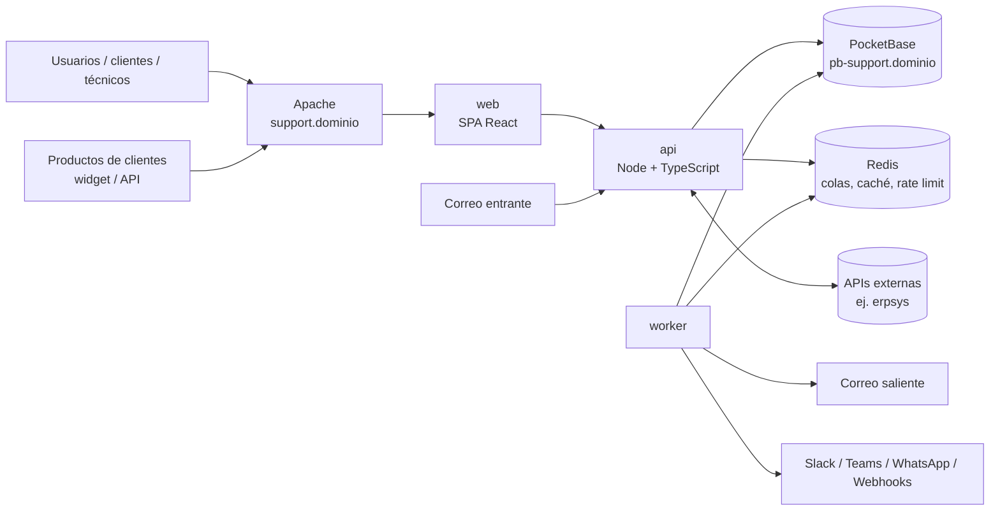

### 4.3 Por qué la API está en medio

El navegador y los productos externos **nunca hablan directo con PocketBase**: todo pasa por la API. Así centralizamos permisos, validaciones, auditoría, notificaciones e integraciones. La consola de PocketBase se publica en su dominio (`pb-support.…`) solo para administración, con restricción por IP recomendada; la API de datos de PocketBase no se usa desde fuera. Las reglas de acceso de PocketBase se configuran igualmente como segunda línea de defensa.

---

## 5. Stack propuesto

| Capa | Tecnología | Motivo |
|---|---|---|
| Backend API | Node.js 22 + TypeScript + Fastify | Rápido, tipado, encaja con la estructura pedida (controllers, services, validators…). |
| Validación | Zod (esquemas compartidos con el frontend) | Un solo esquema para validar y tipar. |
| Base de datos | PocketBase (una por instancia) | Requisito; archivos, auth collections, *view collections* para estadísticas. |
| Colas y tareas | BullMQ + Redis | Correos, notificaciones, sincronizaciones, SLA, correo entrante. |
| Eventos entre servicios | Redis Streams + outbox + webhooks firmados | Conexión desacoplada con erpsyschat, erpsys y otros sistemas. |
| Frontend | React + Vite + TypeScript, TanStack Query, dnd-kit | UI tipo ToDo/Kanban con arrastrar y soltar. |
| UI | Tailwind CSS sobre variables CSS (design tokens) + componentes accesibles (Radix/shadcn) | Base visual de erpsys, modo claro/oscuro y temas de color intercambiables. |
| Traducción (i18n) | i18next + react-i18next (web), i18next (api y correos), `Intl` para fechas y números | Español, inglés y portugués desde el día uno. |
| Gráficas | Apache ECharts o Recharts | Dashboards de estadísticas. |
| Correo | Nodemailer (SMTP) + plantillas MJML/Handlebars | Compatible con ZeptoMail, SES, Mailgun, etc. |
| Docs de API | OpenAPI 3 (generado desde los esquemas Zod) + Swagger UI | Para que los clientes integren sus productos. |
| Pruebas | Vitest + Supertest + Playwright | Unitarias, de API y de extremo a extremo. |
| Contenedores | Docker + Docker Compose | Requisito. Apache del host como proxy. |
| CI | GitHub Actions | Lint, pruebas, build de imágenes. |

---

## 6. Estructura del proyecto (monorepo dentro de `v2/`)

```
v2/
├── ROADMAP_MVP.md                 ← este documento
├── docker/
│   ├── docker-compose.yml         ← una instancia: web, api, worker, redis, pocketbase
│   ├── docker-compose.prod.yml
│   └── docker-compose.dev.yml     ← + mailpit para probar correos
├── ops/
│   ├── instance-cli/              ← create-instance, upgrade, backup, restore, suspend
│   ├── templates/                 ← plantillas de .env y vhosts de Apache por instancia
│   └── control/                   ← consola y registro de instancias (fase 2)
├── apps/
│   ├── api/
│   │   └── src/
│   │       ├── config/            ← variables de entorno validadas, constantes
│   │       ├── routes/            ← definición de rutas por módulo (v1, public, platform)
│   │       ├── controllers/       ← reciben la petición, llaman servicios, responden
│   │       ├── services/          ← lógica de negocio (tickets, etapas, SLA, reportes…)
│   │       ├── models/            ← repositorios sobre PocketBase y mapeo de colecciones
│   │       ├── middlewares/       ← auth JWT, RBAC, idioma, rate limit, errores, auditoría
│   │       ├── validators/        ← esquemas Zod de entrada
│   │       ├── types/             ← tipos de dominio y DTOs
│   │       ├── utils/             ← fechas hábiles, cifrado, paginación, logger
│   │       ├── i18n/              ← mensajes de la API y correos en es / en / pt
│   │       ├── db/                ← cliente PocketBase, migraciones, semillas
│   │       ├── connectors/        ← interfaz común de conectores (erpsys, erpsyschat, CSV, REST)
│   │       ├── channels/          ← salida: email, webhook, slack, teams, whatsapp
│   │       ├── inbound/           ← entrada: correo (IMAP / webhook), API, widget
│   │       ├── events/            ← eventos de dominio (ticket.created, stage.completed…)
│   │       ├── jobs/              ← workers BullMQ y tareas programadas
│   │       ├── docs/              ← OpenAPI
│   │       └── server.ts / worker.ts
│   ├── web/
│   │   └── src/
│   │       ├── app/               ← router, layout, providers
│   │       ├── pages/             ← vistas
│   │       ├── features/          ← tickets, implementations, tasks, portal, admin, reports, platform
│   │       ├── components/        ← UI reutilizable
│   │       ├── theme/             ← tokens de diseño, temas de color, modo claro/oscuro
│   │       ├── i18n/              ← locales/es, locales/en, locales/pt
│   │       ├── hooks/ services/ stores/ types/ utils/
│   ├── widget/                    ← Web Component embebible <helpdesk-widget>
│   ├── connector-erpsyschat/      ← microservicio de integración con erpsyschat
│   └── connector-erpsys/          ← microservicio de sincronización con erpsys
├── packages/
│   ├── shared/                    ← esquemas Zod, tipos y claves de traducción compartidos
│   ├── ui-theme/                  ← tokens de diseño y temas reutilizables por web y widget
│   └── sdk-js/                    ← SDK para integrar productos (luego sdk-php para erpsys)
├── pocketbase/
│   ├── Dockerfile
│   ├── pb_migrations/             ← esquema de la base de cada instancia
│   └── pb_hooks/                  ← numeración de tickets, validaciones de última línea
└── scripts/                       ← seed-demo, check-i18n (claves faltantes), utilidades
```

Reglas: los `controllers` no tocan PocketBase directamente (pasan por `services` → `models`); los `validators` se ejecutan en `routes` antes del controlador; los `services` emiten `events` y los `jobs` reaccionan (notificaciones, métricas), así una petición no espera a que se envíe un correo.

---

## 7. Modelo de datos (PocketBase)

### 7.1 Base de cada instancia (una por empresa)

Es la base que se ve en `https://pb-support.erpsys.pro/_/#/` para nuestra instancia, y en `pb-support.<dominio>` para cada empresa.

### 7.2 Reglas de normalización

1. **Una sola entidad de trabajo** (`work_items`) para soporte, implementación, tarea y cualquier tipo futuro. Lo que cambia entre tipos (flujo, etapas, campos extra) vive en **catálogos configurables**, no en tablas distintas ni en código.
2. **Nada de textos libres para valores repetidos**: tipo, estado, prioridad, categoría, canal, rol, etc. son **relaciones a catálogos** (`work_item_types`, `statuses`, `priorities`…). Cambiar el nombre de un estado no toca los casos.
3. **Relaciones muchos a muchos con datos propios** van en **tablas intermedias** (`team_members`, `client_products`, `work_item_participants`, `work_item_tags`, `stage_dependencies`).
4. **Historial separado y solo de inserción**: estados, asignaciones y eventos se guardan en tablas de historial (`work_item_status_history`, `work_item_assignments`, `work_item_events`). De ahí salen métricas como "quién resolvió", "tiempo en cada estado" o "tiempo esperando al cliente".
5. **Campos de caché explícitos**: algunos valores derivados se guardan por rendimiento (ej. `progress_percent`, `status_category`, `resolved_by`). Están marcados como *(caché)*, solo los escriben los servicios y se pueden recalcular desde el historial.
6. **Adjuntos y comentarios con un único dueño**: un adjunto pertenece a exactamente uno de: caso, comentario, etapa o requerimiento al cliente (validado en servicio y en hook de PocketBase).
7. **Integridad**: relaciones de PocketBase con borrado en cascada o restringido según el caso, índices únicos (ej. número por tipo, participante por rol), borrado lógico (`deleted_at`) para casos, y todas las colecciones con `created` y `updated`.
8. **Textos traducibles**: los catálogos guardan una **clave de traducción** (`label_key`) además del nombre, para mostrarse en es/en/pt.

### 7.3 Colecciones por dominio

**A. Personas y organización**

| Colección | Campos principales |
|---|---|
| `users` (auth) | nombre, correo, teléfono, avatar, rol → `roles`, cliente → `clients` (vacío si es personal interno), estado, idioma, zona horaria, modo (`light`/`dark`/`system`), tema de color, último acceso |
| `roles` | código (`owner`, `manager`, `technician`, `agent`, `client_admin`, `client_user`, `viewer`), ámbito (`staff`/`client`), `label_key` |
| `permissions` / `role_permissions` | permiso (`work_item.create`, `stage.complete`, `client_request.review`, `settings.manage`…); tabla intermedia rol ↔ permiso |
| `teams` / `team_members` | equipo (nombre, producto principal); miembro: equipo → `teams`, usuario → `users`, rol en el equipo (`leader`/`member`) |
| `clients` | nombre, NIT/ID fiscal, estado, política SLA → `sla_policies`, ejecutivo de cuenta → `users` |
| `client_contacts` | cliente → `clients`, usuario → `users`, tipo de contacto (`primary`, `technical`, `approver`, `billing`), recibe avisos (sí/no) |
| `products` / `client_products` | producto (código, nombre, activo); contratación: cliente, producto, plan, estado de licencia, vigencia |
| `external_identities` | conector → `connectors`, entidad (`user`/`client`), usuario → `users` **o** cliente → `clients`, ID externo, copia de los datos, último sincronizado (único por conector + entidad + ID) |

**B. Catálogos configurables del trabajo**

| Colección | Campos principales |
|---|---|
| `work_item_types` | código, nombre, `label_key`, icono, color, prefijo de numeración, flujo por defecto → `workflows`, **tiene etapas** (sí/no), **visible al cliente** (sí/no), requiere producto (sí/no), prioridad por defecto → `priorities`, activo |
| `workflows` | nombre, aplica a (`work_item` / `stage`) |
| `statuses` | flujo → `workflows`, código, nombre, `label_key`, **categoría** (`new`, `open`, `in_progress`, `waiting_client`, `waiting_internal`, `resolved`, `closed`, `cancelled`), color, orden, inicial (sí/no), final (sí/no), **pausa SLA** (sí/no), nombre que ve el cliente |
| `workflow_transitions` | estado origen → `statuses`, estado destino → `statuses` (el flujo se deduce de los estados; ambos deben ser del mismo flujo), roles permitidos → `roles` (múltiple; vacío = personal con permiso), exige comentario, exige evidencia |
| `event_types` | catálogo de eventos (`work_item.created`, `stage.unlocked`, `client_request.submitted`…): módulo, `label_key`, visible al cliente. Lo usan historial, notificaciones, outbox y webhooks |
| `connectors` | sistemas externos (`erpsys`, `erpsyschat`, REST, CSV): URL, credenciales cifradas, mapeo, frecuencia, salud. Lo usan identidades y referencias externas |
| `priorities` | código, nombre, `label_key`, nivel, color |
| `categories` | tipo → `work_item_types`, nombre, categoría padre → `categories` (árbol) |
| `channels` | código (`web`, `portal`, `email`, `api`, `widget`, `chat`), nombre |
| `tags` | nombre, color |
| `custom_fields` | tipo de caso → `work_item_types`, clave, `label_key`, tipo de dato (texto, número, fecha, lista, usuario, archivo), opciones, obligatorio, visible al cliente, orden |

**C. Casos y su trabajo**

| Colección | Campos principales |
|---|---|
| `work_items` | número (secuencial por tipo, ej. `SOP-0012`, `IMP-0003`), tipo → `work_item_types`, título, descripción, estado → `statuses`, prioridad → `priorities`, categoría → `categories`, producto → `products`, cliente → `clients`, canal → `channels`, **solicitante** → `users`, **creado por** → `users`, **asignado actual** → `users`, equipo → `teams`, caso padre → `work_items`, plantilla → `templates`, política SLA → `sla_policies`, fecha límite, inicio y fin planificados, fechas de primera respuesta / resuelto / cerrado, `status_category` *(caché)*, `progress_percent` *(caché)*, `resolved_by` → `users` *(caché)*, `deleted_at` |
| `custom_field_values` | caso → `work_items`, campo → `custom_fields`, valor (texto / número / fecha / JSON) — único por caso + campo |
| `work_item_participants` | caso, usuario, rol en el caso (`watcher`, `collaborator`, `approver`, `client_contact`), recibe avisos — único por caso + usuario + rol |
| `work_item_assignments` | caso, etapa (opcional), asignado → `users`, equipo, asignado por → `users`, desde, hasta (historial de asignaciones) |
| `work_item_status_history` | caso, estado anterior, estado nuevo, categoría nueva, cambiado por → `users`, fecha, segundos en el estado anterior |
| `work_item_links` | caso origen, caso destino, tipo (`relates_to`, `duplicates`, `blocks`, `caused_by`) |
| `work_item_tags` | caso ↔ etiqueta |
| `stages` | caso → `work_items`, etapa de plantilla de origen, nombre, `label_key` opcional, descripción, orden, estado → `statuses` (flujo de etapas), **depende de** (`internal`/`client`/`shared`), responsable → `users`, inicio y fin planificados, inicio y fin reales, completada por → `users`, peso, visible al cliente, exige evidencia, exige aprobación del cliente |
| `stage_dependencies` | etapa → `stages`, depende de → `stages`, tipo (`finish_to_start`) |
| `checklist_items` | etapa → `stages` (o caso), texto, orden, hecho, hecho por, fecha |
| `client_requests` | **requerimiento al cliente**: caso → `work_items`, etapa → `stages`, título, descripción, tipo (`information`, `document`, `data_upload`, `access`, `approval`, `meeting`), pedido por → `users`, contacto del cliente → `users`, fecha límite, **bloqueante** (sí/no), estado (`pending`, `submitted`, `in_review`, `accepted`, `rejected`, `cancelled`), enviado en, revisado por, revisado en, motivo de rechazo, recordatorios enviados, último recordatorio |
| `comments` | caso, etapa (opcional), requerimiento (opcional), autor → `users`, cuerpo, visibilidad (`public`/`internal`), canal → `channels` |
| `attachments` | **un solo dueño**: caso, comentario, etapa o requerimiento; archivo (imágenes, videos, PDF, Office, Excel, zip), tipo MIME, tamaño, uso (`general`, `evidence`, `client_submission`, `template_file`), subido por → `users` |
| `work_item_events` | caso, actor, tipo de evento (`created`, `status_changed`, `assigned`, `stage_completed`, `client_request_submitted`…), valores anterior/nuevo, metadatos (línea de tiempo y auditoría funcional) |
| `time_entries` (fase 3) | caso, etapa, usuario, minutos, fecha, facturable |

**D. Plantillas**

| Colección | Campos principales |
|---|---|
| `templates` | tipo → `work_item_types`, producto, nombre, descripción, activa |
| `template_stages` | plantilla, nombre, orden, duración en días hábiles, depende de (`internal`/`client`/`shared`), rol sugerido → `roles`, peso, exige evidencia, exige aprobación |
| `template_stage_dependencies` | etapa de plantilla ↔ etapa de plantilla de la que depende |
| `template_client_requests` | etapa de plantilla, título, descripción, tipo, bloqueante, días para entregar, archivo modelo (ej. Excel de carga) |
| `template_checklist_items` | etapa de plantilla, texto, orden |

**E. SLA y calendario**

| Colección | Campos principales |
|---|---|
| `sla_policies` / `sla_targets` | política; metas por tipo de caso + prioridad: minutos de primera respuesta y de resolución |
| `business_calendars` / `holidays` | horario laboral por día; feriados |
| `sla_timers` | caso, métrica (`first_response`, `resolution`), inicio, total pausado, vence en, incumplido en, estado |

**F. Notificaciones, canales e integraciones**

| Colección | Campos principales |
|---|---|
| `notification_rules` | evento, tipo de caso (opcional), destinatarios (solicitante, contactos del cliente, asignado, equipo, jefe, participantes), canales, plantilla |
| `notification_templates` | evento, canal, idioma, asunto, cuerpo |
| `notification_channels` | tipo (`email`, `webhook`, `erpsyschat`, `slack`, `teams`, `whatsapp`, `telegram`), configuración cifrada |
| `notifications` | evento, destinatario, canal, estado (`pending`/`sent`/`failed`), intentos, error |
| `user_notification_prefs` | usuario, evento, canales activos, resumen diario |
| `email_senders` | nombre, correo remitente, responder a, proveedor, credenciales cifradas, verificación SPF/DKIM, por defecto, eventos que usa |
| `inbound_mailboxes` / `email_threads` | buzones de entrada (IMAP / webhook) con tipo de caso y equipo por defecto; Message-ID ↔ caso |
| `connectors` / `sync_runs` | conectores (erpsys, erpsyschat, REST, CSV) con credenciales cifradas, mapeo, frecuencia, salud; ejecuciones de sincronización |
| `external_refs` | caso → `work_items`, sistema, tipo de objeto (conversación, pedido…), ID externo, URL |
| `event_outbox` | evento, carga, destino, estado, intentos, próximo reintento |
| `api_keys` / `webhooks` / `webhook_deliveries` | llaves con hash y scopes; webhooks salientes firmados y sus entregas |

**G. Sistema**

| Colección | Campos principales |
|---|---|
| `settings` / `settings_history` | configuración de la empresa (sección 14); historial de cambios sin secretos |
| `translations_overrides` | clave, idioma, texto personalizado por la empresa |
| `saved_views` | usuario o equipo, nombre, modo del tablero, filtros, orden, densidad, favorito |
| `canned_responses` | respuestas rápidas por tipo de caso e idioma |
| `sessions` / `audit_logs` | sesiones con refresh token (hash); auditoría de acciones sensibles |
| *Vistas de estadísticas* | `stats_by_technician`, `stats_by_requester`, `stats_by_client`, `stats_by_type`, `stats_overdue`, `stats_implementation_progress`, `stats_client_wait_time` (view collections con SQL de agregación) |

### 7.4 Diagrama de relaciones (núcleo)

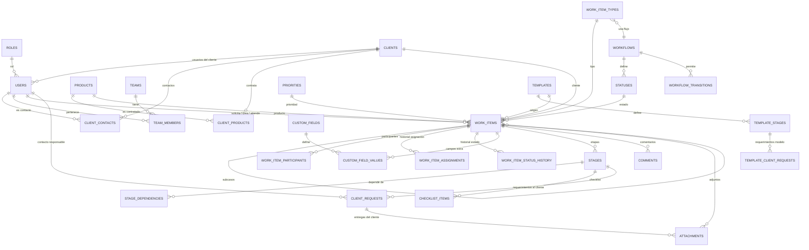

### 7.5 Implementación en PocketBase (hecho, 2026-10-02)

El esquema ya está creado en `https://pb-support.erpsys.pro/_/` con **68 colecciones** relacionadas.

- **Migraciones versionadas** en `v2/pocketbase/pb_migrations/`, una por dominio: `catalogs`, `sla_calendar`, `organization`, `templates`, `work_items`, `notifications_integrations`, `system` y `seed_defaults`. Todas se pueden revertir (`migrate down`) y volver a aplicar.
- **Datos de fábrica**:
  - 7 roles y 26 permisos;
  - 20 tipos de evento;
  - 4 flujos (soporte, implementación, etapas, tareas) con 25 estados y sus transiciones;
  - 3 tipos de caso (`SOP`, `IMP`, `TAR`) y categorías de soporte;
  - calendario laboral de Guatemala con feriados, y SLA "Estándar";
  - equipos Soporte e Implementaciones;
  - la plantilla **"Implementación ERPSYS"**: 6 etapas secuenciales con checklists y 7 requerimientos al cliente, 5 de ellos en "Carga de información";
  - 16 reglas de aviso por correo y la configuración inicial de la empresa.
- **Hooks de integridad** (`v2/pocketbase/pb_hooks/`), que se aplican también a lo que se edita desde el panel:
  - numeración por tipo (`SOP-0001`, `IMP-0001`) con una secuencia atómica;
  - el estado de un caso debe ser del flujo de su tipo, y el de una etapa, del flujo de etapas;
  - dependencias sin ciclos y dentro del mismo caso o plantilla;
  - un requerimiento o comentario solo puede ligarse a etapas de su mismo caso;
  - adjuntos y checklists con un único dueño;
  - el solicitante y los contactos deben pertenecer al cliente del caso;
  - un solo estado inicial por flujo y un solo valor "por defecto" en cada catálogo.
- **Cachés mantenidas automáticamente**:
  - `status_category`;
  - `resolved_at`, `resolved_by` y `closed_at`, que se limpian al reabrir;
  - `progress_percent`, que es el peso de las etapas cerradas sobre el total, sin contar las omitidas.
- **Historial de estados automático** con quién cambió (`updated_by`) y cuántos segundos pasó el caso en el estado anterior.
- **Reglas de acceso**: todas las colecciones están cerradas (solo superusuarios). La API de v2 aplicará los permisos por rol y cliente.
- **Prueba de integración**: `v2/scripts/test-schema.py`, con 41 comprobaciones del flujo completo y de cada regla de integridad. Debe correrse contra una base desechable.

---

## 8. Estados y flujos

Los flujos son **configurables por tipo de caso** (`workflows`, `statuses`, `workflow_transitions`). Abajo están los que vienen de fábrica; cada empresa puede renombrar estados, agregar otros o crear tipos nuevos con su propio flujo, siempre asignando cada estado a una categoría fija.

### Ticket de soporte (flujo por defecto)

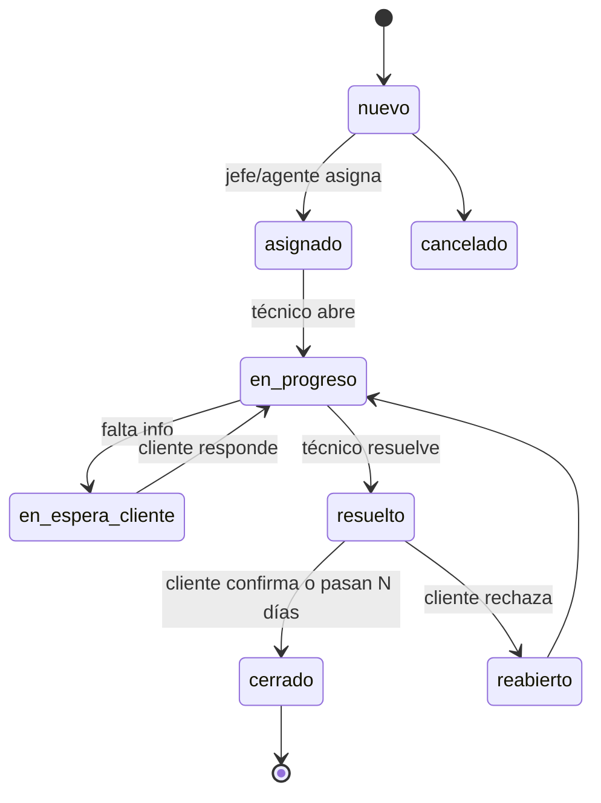

Al crear el ticket, el sistema registra automáticamente **fecha, hora, usuario, cliente, producto y canal**; el usuario solo debe escribir el **título** y, si quiere, descripción y adjuntos (imágenes, videos, documentos).

### Implementación

- **Estados del caso**: `planificada` → `en_curso` ↔ `esperando_cliente` → `en_pausa` ↔ `en_curso` → `completada` (o `cancelada`). El estado se **deriva de sus etapas**: si la etapa actual espera al cliente, la implementación pasa a "Esperando cliente".
- **Estados de etapa**: `pendiente` → `en_curso` ↔ `esperando_cliente` → `en_revision` → `completada` (también `bloqueada` y `omitida`).
- **Dependencias**: una etapa no puede iniciar hasta que terminen las etapas de las que depende (por defecto, la anterior). Al completarse una etapa, se **desbloquea la siguiente** y se avisa a su responsable y al cliente.
- **De quién depende cada etapa**: nuestro equipo, el cliente o ambos. Se muestra en la línea de tiempo con un color distinto para que el cliente sepa cuándo le toca actuar.
- Al crearla desde una plantilla se generan etapas, dependencias, checklists y **requerimientos al cliente**, con fechas en días hábiles desde la fecha de inicio.
- **Avance** = suma de pesos de etapas completadas / suma total.
- **Etapa atrasada**: fin planificado < hoy y no completada. El retraso se separa en **atribuible a nuestro equipo** y **atribuible al cliente** (tiempo en "esperando cliente").
- **Fecha estimada de término**: fin planificado de la última etapa + retraso acumulado actual, recalculada cada vez que el cliente entrega algo tarde; se muestra "faltan X días hábiles" o "atrasada X días (Y por espera del cliente)".
- Al completar una etapa se puede exigir evidencia (archivo o comentario) y/o **aprobación del cliente**.

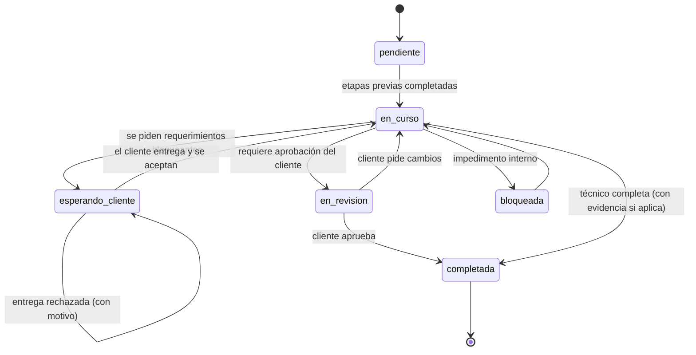

### Requerimientos al cliente (ej. etapa "Carga de información")

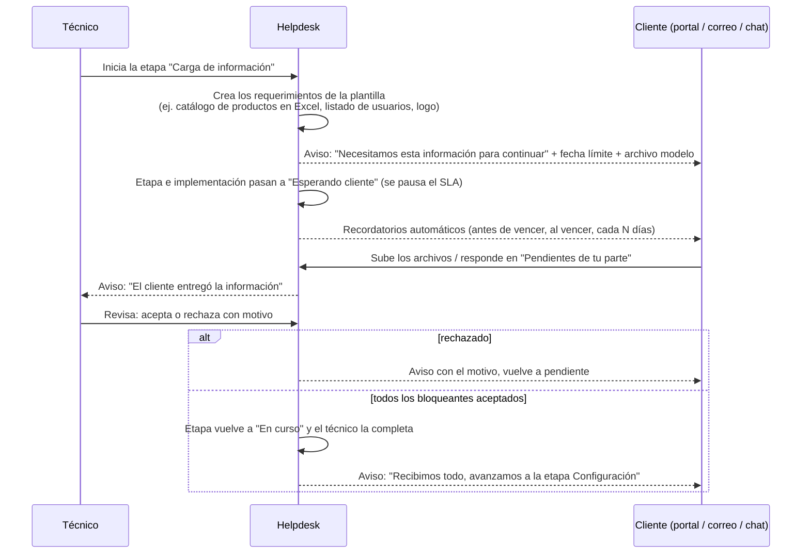

- Tipos de requerimiento: información (formulario o texto), documento, carga de datos (con archivo modelo, ej. Excel), accesos/credenciales (se guardan cifrados), aprobación (firma de conformidad) y reunión (agendar).
- Cada requerimiento tiene **contacto responsable del cliente**, fecha límite, si es **bloqueante**, historial de entregas y comentarios propios.
- Si vence sin respuesta: aviso al contacto, luego al `client_admin` y al ejecutivo de cuenta (escalamiento configurable).
- El técnico también puede agregar requerimientos manuales en cualquier etapa (no solo los de la plantilla).
- Esto sirve para cualquier tipo de caso, no solo implementaciones (ej. un ticket de soporte que necesita un acceso remoto).

### Tarea interna

`pendiente` → `en_progreso` → `hecha` (vista tipo ToDo, con fecha límite y prioridad).

### Tipos nuevos

La empresa crea un tipo (ej. "Capacitación") desde la configuración: nombre, icono, prefijo, flujo (uno existente o uno nuevo), si tiene etapas, plantilla por defecto, campos extra y si lo ve el cliente. No requiere cambios de código ni de base de datos.

---

## 9. Seguridad

- **Autenticación**: JWT de acceso de corta duración (15 min, firmado con clave asimétrica y rotación de claves) + **refresh token** rotativo en cookie `httpOnly`, `Secure`, `SameSite`, guardado con hash en `sessions` (revocable, cierre de sesión en todos los dispositivos).
- **Proveedores de login**: local (contraseña), **delegado a erpsys** (valida la contraseña contra la API del ERP), y más adelante OAuth (Google/Microsoft) y SSO por JWT firmado desde productos externos (para el modo plugin).
- **Contraseñas**: hash fuerte (bcrypt/argon2), políticas mínimas, recuperación por enlace de un solo uso.
- **Protección de login**: límite de intentos por IP y por cuenta, bloqueo temporal, CAPTCHA tras varios fallos, alertas de inicio de sesión nuevo.
- **2FA (TOTP)** obligatorio para `owner` y operadores de plataforma, opcional para el resto del personal (fase 2).
- **Autorización**: RBAC + alcance por cliente/equipo en cada servicio, y reglas de PocketBase como segunda capa.
- **API keys**: guardadas con hash, prefijo visible, scopes, expiración, límite de peticiones por key, rotación.
- **Webhooks**: firmados con HMAC y marca de tiempo.
- **Archivos**: validación de tipo y tamaño, URLs firmadas de corta duración, antivirus (ClamAV) en fase 2.
- **Secretos**: credenciales de integraciones y bases cifradas (AES-256-GCM) con clave maestra fuera de la base.
- **Red**: cada instancia aislada en su propia red Docker; PocketBase solo accesible por su dominio `pb-support.…` con restricción por IP recomendada; HTTPS con HSTS; CORS configurable (dominios permitidos para el widget); cabeceras de seguridad.
- **Auditoría**: registro de acciones sensibles (permisos, borrados, exportaciones, accesos de soporte de plataforma).
- **Respaldos**: copia diaria por instancia (respaldos de PocketBase y archivos hacia almacenamiento S3 compatible) con retención y prueba de restauración.

---

## 10. Integraciones y APIs

### 10.1 Consumir APIs externas (clientes y usuarios)

Patrón **conector**: cada fuente implementa la misma interfaz (`listClients`, `listUsers`, `lookupUser`, `authenticate`, `listProducts`).

- **Conector erpsys** (primero): empresas, usuarios, licencias, autenticación delegada.
- Conector **REST genérico** configurable (URL, autenticación, mapeo de campos) y **importación CSV**.
- Modos de sincronización: al vuelo (JIT, al iniciar sesión o registrarse), programada (cada N minutos), y por webhook desde la fuente.
- Cada registro sincronizado guarda `external_source` + `external_id` para evitar duplicados.

### 10.2 Exponer APIs (para que los productos creen tickets)

- `POST /public/v1/work-items` crear caso de cualquier tipo habilitado (por defecto soporte, con adjuntos), `GET /public/v1/work-items/{ref}` estado y avance, `POST /public/v1/work-items/{ref}/comments`, `GET /public/v1/work-items?requester=...&type=...`, `GET /public/v1/work-items/{ref}/client-requests` y `POST /public/v1/client-requests/{id}/submit` (para que el cliente entregue requerimientos desde su propio sistema o desde el chat).
- Autenticación con **API key** de la instancia; opcionalmente "en nombre de" un usuario (se crea o vincula por correo/ID externo).
- **Idempotencia** con cabecera `Idempotency-Key` y referencia externa.
- **Webhooks salientes**: `ticket.created`, `ticket.status_changed`, `ticket.assigned`, `comment.created`, `stage.completed`, `implementation.completed`.
- Documentación OpenAPI pública y colección de ejemplos.

### 10.3 Modo plugin

1. **Widget embebible** (`<script>` + `<helpdesk-widget>`): botón "Reportar problema" dentro del producto del cliente (ej. erpsys) para crear tickets y ver "mis tickets". Captura automática de URL, navegador y captura de pantalla opcional.
2. **SSO por token firmado**: el producto anfitrión firma un JWT con el secreto de la instancia (usuario, correo, cliente, idioma y tema); el helpdesk confía y crea o vincula al usuario sin otra contraseña.
3. **Portal en iframe** con el mismo SSO.
4. **SDKs**: JavaScript/TypeScript y PHP (para erpsys).

### 10.4 API interna (la usa el frontend)

`/api/v1/auth/*`, `/api/v1/me`, `/api/v1/work-items` (+ `/comments`, `/attachments`, `/assign`, `/transition`, `/participants`, `/links`), `/api/v1/stages/{id}` (+ `/start`, `/complete`, `/approve`), `/api/v1/client-requests` (+ `/submit`, `/accept`, `/reject`, `/remind`), `/api/v1/catalog/*` (tipos, flujos, estados, prioridades, categorías, campos extra), `/api/v1/clients`, `/api/v1/users`, `/api/v1/products`, `/api/v1/templates`, `/api/v1/reports/*`, `/api/v1/integrations/*`, `/api/v1/settings`, `/api/v1/me/preferences` (idioma, modo, tema). La consola de instancias tiene su propia API, separada de las instancias.

Todas las respuestas de error devuelven un **código estable** (ej. `TICKET_NOT_FOUND`) más un mensaje traducido según `Accept-Language` o el idioma del usuario.

### 10.5 Microservicios: cómo se conecta con otros sistemas

El helpdesk es un **servicio independiente** que funciona solo, y se conecta con otros productos (erpsyschat, erpsys, sistemas de clientes) **sin acoplarse a su código ni a sus bases de datos**. Cada sistema conserva su base y se comunican solo por contratos públicos:

| Mecanismo | Dirección | Uso |
|---|---|---|
| **API REST pública** (OpenAPI, versionada `/public/v1`) | otros → helpdesk | Crear y consultar tickets, comentar, adjuntar, consultar avance de implementaciones. |
| **Webhooks salientes firmados** (HMAC + marca de tiempo, reintentos) | helpdesk → otros | Avisar `ticket.created`, `ticket.status_changed`, `comment.created`, `stage.completed`, etc. |
| **Webhooks entrantes** | otros → helpdesk | Recibir eventos de otros sistemas (mensaje nuevo en chat, usuario creado en el ERP). |
| **Conectores** (adaptadores) | ambos | Código que traduce entre el helpdesk y un sistema concreto (erpsys, erpsyschat, CRM…). |
| **Bus de eventos interno** (Redis Streams) | interno | Los servicios del helpdesk publican eventos; los conectores y el worker los consumen. |
| **Patrón outbox** | interno | Cada evento se guarda antes de enviarse; si el otro sistema está caído, se reintenta sin perder nada. |
| **Identidad compartida** | ambos | El mismo usuario se reconoce en todos los sistemas por `seraph_id` + correo (o ID externo), y con SSO por token firmado no vuelve a iniciar sesión. |

- **Conectores como contenedores separados** (ej. `connector-erpsyschat`, `connector-erpsys`): se activan o desactivan por empresa desde la configuración, se despliegan y actualizan sin tocar el núcleo, y si uno falla el helpdesk sigue funcionando.
- **Idempotencia**: todo mensaje entre sistemas lleva un ID único (`Idempotency-Key` / `event_id`) para no duplicar tickets o comentarios.
- **Correlación**: cada caso guarda referencias externas (`external_refs`: sistema, tipo, ID, URL) para saber de qué conversación, pedido o usuario vino.
- **Catálogo de eventos** documentado y versionado, para que cualquier sistema nuevo pueda suscribirse.
- **Colección** `external_refs` (ver 7.3 F): caso (`work_items`) → sistema (`erpsyschat`, `erpsys`, `email`…), tipo de objeto, ID externo, URL.

### 10.6 Integración con erpsyschat

erpsyschat (Seraph Chat) es el chat donde los usuarios hablan con soporte: widget flotante en el ERP, app móvil, notificaciones push y su propio hub en PocketBase. El helpdesk y el chat trabajan **de la mano** como dos microservicios:

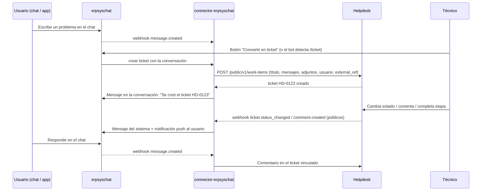

Funciones de la integración:

- **Convertir una conversación en ticket** desde el chat (botón del agente o comando del usuario), con el historial de mensajes y los archivos adjuntos.
- **Vinculación**: el ticket queda ligado a la conversación (y la conversación muestra el número y estado del ticket).
- **Avisos del ticket dentro del chat**: cambios de estado, comentarios públicos y etapas completadas llegan como mensajes del sistema y **notificaciones push** de la app.
- **Respuestas en ambos sentidos** (configurable): lo que el usuario responde en el chat se agrega como comentario del ticket, y los comentarios públicos del técnico aparecen en el chat.
- **"Mis tickets" dentro del chat**: el usuario consulta sus tickets e implementaciones sin salir del chat.
- **Desde el helpdesk**: botón "Abrir conversación" para continuar por chat con el usuario del ticket.
- **Mismo usuario**: ambos sistemas reconocen al usuario por `seraph_id` + correo, con SSO por token firmado.
- **Cada sistema sigue funcionando solo**: si el chat no está disponible, el helpdesk sigue operando y los eventos se envían al volver.

Lo mismo sirve para conectar más adelante otros chats o canales (WhatsApp, Telegram, Slack, Teams) con un conector nuevo, sin cambiar el núcleo.

---

## 11. Notificaciones y canales

### Salida

- Eventos de dominio → **reglas de notificación** → destinatarios → canales → **outbox** con reintentos.
- Destinatarios típicos: solicitante, admin del cliente, técnico asignado, equipo, jefe, observadores.
- Eventos: caso creado, asignado, cambio de estado, comentario público, etapa iniciada, etapa completada, **siguiente etapa desbloqueada**, etapa atrasada, implementación completada, **requerimiento al cliente creado / por vencer / vencido / entregado / aceptado / rechazado**, **aprobación solicitada**, SLA por vencer / vencido, resumen diario para jefes y **resumen semanal de avance para el cliente**.
- El cliente se entera de todo lo que le corresponde: avance de etapas, lo que se le pide y lo que se recibió, por correo, portal y (fase 2) erpsyschat.
- Canales: **correo** (MVP), **erpsyschat** con push a la app y webhooks (fase 2), Slack/Teams/Telegram/WhatsApp (fase 3).
- Preferencias por usuario (qué recibir y por dónde). Plantillas de correo con la marca y el color de la empresa, enviadas **en el idioma de cada destinatario** (es/en/pt).
- Los correos de etapas de una implementación pueden limitarse al contacto principal del cliente (configurable por regla).

### Entrada (correo → ticket)

- Buzón por instancia (ej. `soporte@empresa.com`) leído por **IMAP** o por **webhook de correo entrante** del proveedor.
- Correo nuevo → se busca al usuario por remitente (o se crea como contacto del cliente según su dominio) → se crea el ticket con los adjuntos.
- Respuesta a un correo del helpdesk → se agrega como comentario al ticket correcto (por `Message-ID`/`In-Reply-To` o `[#TCK-123]` en el asunto).
- Filtros anti-bucle (respuestas automáticas, rebotes) y lista de remitentes bloqueados.

---

## 12. Estadísticas y reportes

- **Técnicos**: tickets resueltos, tiempo medio de primera respuesta y de resolución, cumplimiento de SLA, carga actual, etapas completadas.
- **Usuarios**: quién levanta más tickets, por tipo y producto.
- **Empresas cliente**: qué empresa levanta más tickets, por producto, tendencia mensual.
- **Atrasos**: tickets vencidos (SLA), tickets sin asignar, implementaciones con etapas atrasadas, días de retraso y fecha estimada de término.
- **Implementaciones**: % de avance, etapas por estado, tiempo real vs planificado por etapa (para mejorar las plantillas), **días de retraso atribuibles al cliente vs a nuestro equipo**.
- **Requerimientos al cliente**: pendientes y vencidos por cliente, tiempo promedio de entrega, entregas rechazadas.
- **Por tipo de caso**: volumen, tiempos y cumplimiento por cada tipo (incluidos los tipos nuevos que cree la empresa).
- Filtros por período, producto, cliente, equipo y técnico; exportación CSV/Excel; envío programado por correo.
- Implementación técnica: *view collections* de PocketBase con SQL de agregación + instantáneas diarias (`metrics_daily`) para gráficas rápidas.

---

## 13. Interfaz

Referencias visuales aportadas (en `v2/referencias-ui/`): tablero tipo ToDo por vencimiento (Zoho ToDo), tablero de tickets por estado con modos de trabajo (Zoho Desk) y panel "Mi trabajo" con contadores, barras de SLA y acciones pendientes. Se adoptan sus patrones con la identidad azul de erpsys.

| ToDo por vencimiento | Tickets por estado |
|---|---|
| 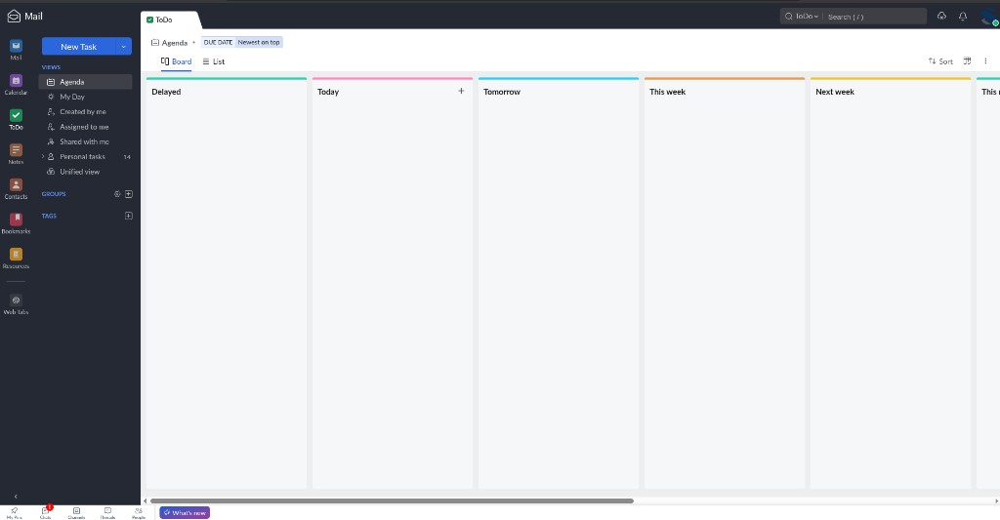 | 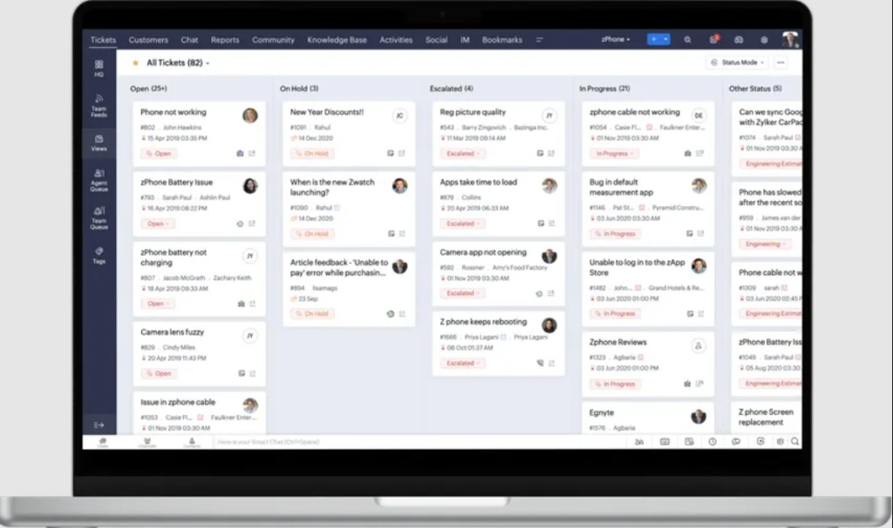 |
| **Modos de trabajo y cambio rápido** | **Mi trabajo** |
| 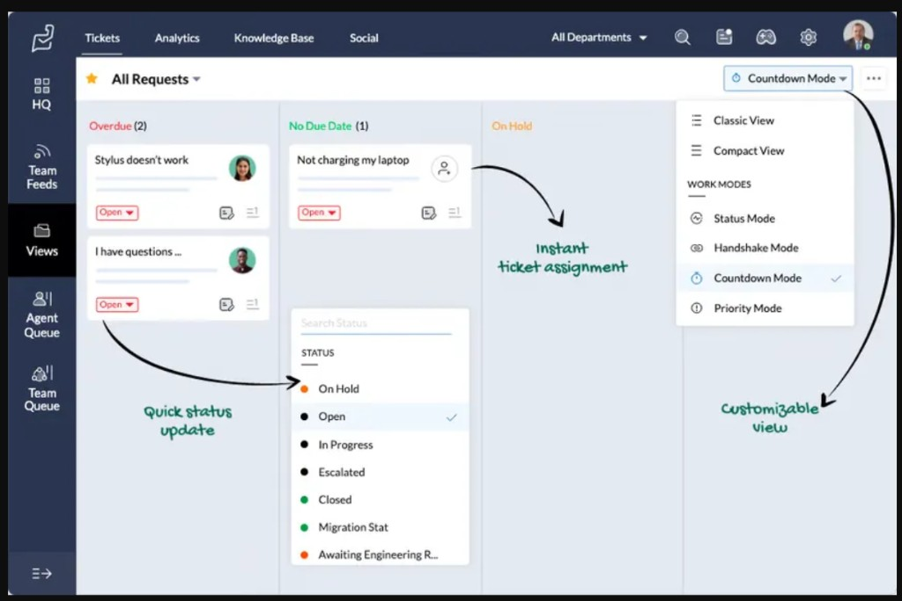 | 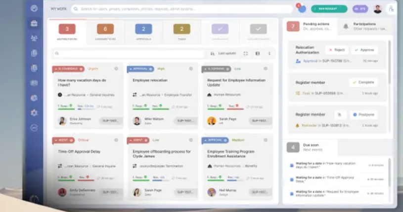 |

### 13.0 Estructura de pantalla

- **Barra lateral izquierda oscura** (azul erpsys `#001f45` / `#002c60`) con iconos de módulos: Inicio, Tickets, Tareas, Implementaciones, Clientes, Reportes, Chat (erpsyschat), Configuración. Se puede contraer.
- **Panel de vistas** junto a la barra: botón grande **"Nuevo"** con menú (ticket, tarea, implementación) y lista de vistas:
  *Agenda*, *Mi día*, *Asignados a mí*, *Creados por mí*, *Compartidos conmigo*, *De mi equipo*, *Sin asignar*, *Vista unificada*; luego **Grupos** (equipos/productos) y **Etiquetas**, cada uno con su contador.
- **Barra superior**: buscador global (atajo `/`), notificaciones, selector de idioma, interruptor claro/oscuro y avatar con preferencias.
- **Encabezado de la vista**: nombre de la vista con favorito (★), chips de filtros activos (ej. "Vencimiento · más recientes primero"), selector **Tablero / Lista**, ordenar, densidad y menú "⋯".

### 13.1 Tablero de tickets con "modos de trabajo"

Un mismo tablero que se reorganiza según lo que se necesite, como en las referencias:

| Modo | Columnas | Arrastrar una tarjeta… |
|---|---|---|
| **Estado** | Nuevo, Abierto, En espera, Escalado, En progreso, Resuelto… | cambia el estado |
| **Vencimiento** (tipo ToDo) | Atrasados, Hoy, Mañana, Esta semana, Próxima semana, Después, Sin fecha | cambia la fecha límite |
| **Asignación** | Sin asignar + una columna por técnico | asigna al técnico (con su carga visible) |
| **Prioridad** | Crítica, Alta, Media, Baja | cambia la prioridad |
| **Cliente / Producto** | una columna por cliente o producto | reclasifica |

- Cada columna tiene **borde superior de color**, título y contador; botón "+" para crear directamente en esa columna (ej. una tarea para "Hoy").
- **Tarjeta de ticket**: título, número `#HD-0123`, solicitante y empresa, fecha/hora, **etiqueta de estado con menú desplegable** para cambiarlo sin abrir el ticket, etiqueta de prioridad, **avatar del técnico** (o iniciales; clic para **asignar al instante**), iconos con número de adjuntos y comentarios, y **barras de SLA** (primera respuesta y resolución) que pasan de verde a ámbar a rojo.
- **Tarjeta de implementación**: además, barra de avance de etapas, etapa actual, "faltan X días" o "atrasada X días", y un aviso **"Esperando al cliente: 2 pendientes"** cuando aplica.
- **Densidad**: clásica (con detalles) o compacta (solo título, número y estado).
- **Vista Lista** con columnas configurables, selección múltiple y acciones masivas (asignar, cambiar estado, etiquetar).

### 13.2 "Mi trabajo" (inicio de cada usuario)

- **Fichas de contadores** arriba: *Esperando mi respuesta*, *Asignados a mí*, *Entregas del cliente por revisar*, *Esperando al cliente*, *Tareas*, *Atrasados*, *Resueltos hoy*; al hacer clic filtran las tarjetas de abajo.
- **Cuadrícula de tarjetas** con etiqueta de tipo (soporte, implementación, tarea, aprobación), prioridad, barras de SLA, persona y número.
- **Panel derecho**:
  - *Acciones pendientes*: aprobar/rechazar, completar, posponer, sin abrir el ticket.
  - *Vence pronto*: lista de lo que vence en las próximas horas.
  - *Participaciones*: tickets donde me mencionaron o soy observador.
- **Mi día**: lista tipo ToDo agrupada en *Atrasado / Hoy / Próximo / Sin fecha*, con casillas para completar tareas y etapas, alta rápida con una línea y atajos de teclado.

### 13.3 Otras vistas

- **Detalle de ticket**: panel lateral con datos, conversación (pública/interna), adjuntos con vista previa (imágenes y video), historial, conversación de erpsyschat vinculada, botones de acción claros (Asignar, Iniciar, Resolver).
- **Implementaciones**: línea de tiempo/Gantt de etapas, barra de avance, "faltan X días", responsables por etapa. **Diseño aprobado** (referencia `referencias-ui/05-vista-implementacion.png`):
  - Cabecera con **anillo de avance** (%), nombre, cliente, fecha estimada y accesos rápidos.
  - Aviso **"Esperando al cliente"** con los requerimientos pendientes cuando aplica.
  - Tarjeta **"Etapa actual"** con su checklist (punto verde = hecho, medio lleno = en curso, vacío = pendiente; lo hecho aparece tachado), "N de M tareas" y duración estimada.
  - **Cuadrícula de etapas**: número, nombre, estado (Hecho / En curso / Esperando cliente / Pendiente), barra de avance, resumen, duración y de quién depende.
  - **Bitácora** con fecha de cada avance.

  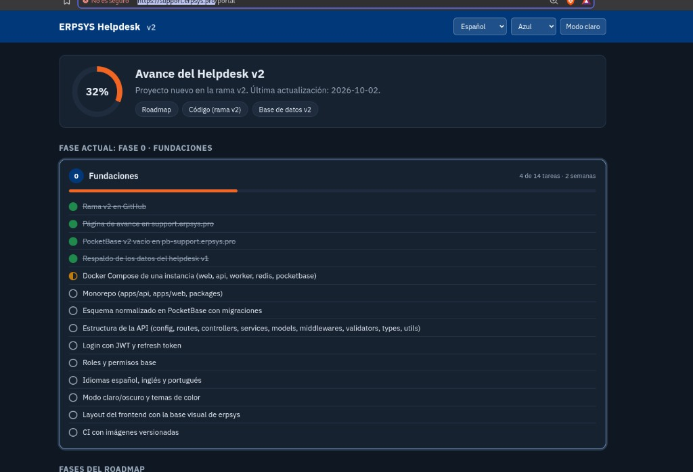
- **Panel del jefe**: carga por técnico, asignación por arrastre, atrasos, KPIs.
- **Portal del cliente**: crear ticket en un paso (título + adjuntos opcionales), mis casos, avance de implementaciones de su empresa en línea de tiempo (mostrando qué etapas dependen de ellos), comentarios, y una sección destacada **"Pendientes de tu parte"** con cada requerimiento: qué se necesita, archivo modelo para descargar, fecha límite, botón para subir o responder, y estado de la revisión (aceptado / rechazado con motivo).
- **Revisión de entregas** (técnico): bandeja con lo que el cliente entregó, vista previa de archivos y botones Aceptar / Rechazar con motivo.
- **Configuración de tipos de caso**: crear y editar tipos, flujos de estados (con editor visual de transiciones), campos extra y plantillas con sus etapas, dependencias y requerimientos al cliente.
- **Administración**: usuarios y roles, empresas cliente y sus usuarios, productos, equipos, plantillas, SLA, canales, buzones, integraciones, API keys, marca (ver sección 14).
- **Preferencias del usuario**: idioma, modo claro/oscuro/sistema y tema de color, accesibles desde el menú de usuario y desde la pantalla de inicio de sesión.
- **Consola de instancias** (nosotros, aplicación aparte): alta de empresas con creación automática de su instancia en su dominio, versión, actualizaciones, respaldos, licencia y estado.
- Responsive (usable en celular) y accesible (contraste AA, navegación con teclado).

### 13.4 Idiomas (i18n): español, inglés y portugués

- **Todo traducido** desde el MVP: interfaz, mensajes de error de la API, correos, plantillas de implementación por defecto, estados, prioridades, widget y documentación de la API.
- **Idioma aplicado**: preferencia del usuario → idioma por defecto de la empresa → idioma del navegador → español.
- **Selector de idioma** en el menú de usuario y en la pantalla de inicio de sesión; el cambio es inmediato, sin recargar.
- **Formatos locales** con `Intl`: fechas, horas (con la zona horaria del usuario), números y monedas.
- **Archivos de traducción** por idioma y módulo (`locales/es/tickets.json`, `locales/en/tickets.json`, `locales/pt/tickets.json`…) compartidos entre web, API y correos.
- **Control de calidad**: un script en CI falla si falta una clave en algún idioma; no se permiten textos fijos en los componentes.
- **Textos de cada empresa**: la empresa puede ajustar etiquetas (`translations_overrides`) sin tocar el código.
- El contenido que escriben los usuarios (títulos, comentarios) no se traduce; traducción automática opcional en la fase de inteligencia.
- Preparado para agregar más idiomas solo añadiendo una carpeta de traducción.

### 13.5 Diseño, modo claro/oscuro y temas de color

**Base visual: la de erpsys** (`v1.erpsys.pro`), en tonos azules:

| Token | Claro | Uso |
|---|---|---|
| `--primary` | `#00387a` (azul erpsys) | Botones principales, enlaces, barra superior |
| `--primary-dark` | `#002c60` | Hover, encabezados, menú lateral |
| `--primary-panel` | `#001f45` | Fondos del menú en modo oscuro |
| `--primary-light` | `#3d6eaa` | Estados activos suaves, gráficas |
| `--accent` | `#f26522` (naranja erpsys) | Llamadas a la acción destacadas, avisos |
| `--bg` / `--bg-soft` | `#ffffff` / `#f5f8fb` | Fondos |
| `--border` | `#d3d8dd` | Bordes |
| `--text` / `--text-muted` | `#252525` / `#737373` | Textos |
| `--success` / `--danger` | `#1f9d55` / `#c0392b` | Estados |
| Tipografía | IBM Plex Sans (texto) e IBM Plex Serif (títulos) | Igual que erpsys |
| Bordes y sombras | radio 6–10 px, sombras suaves azuladas | Igual que erpsys |

- **Modo claro, oscuro o "según el sistema"**, con interruptor siempre visible en la barra superior. Sin parpadeo al cargar (la preferencia se aplica antes de pintar la página).
- **Temas de color** intercambiables, siguiendo los de erpsys: **Azul erpsys** (por defecto), Naranja, Verde, Morado, Rosa y Gris pizarra, cada uno con su versión clara y oscura.
- **Color de marca propio**: cada empresa puede elegir su color principal y su logo; el sistema genera la paleta completa (tonos claros y oscuros) y verifica que el contraste sea legible.
- **Quién decide**: la empresa define el tema y el modo por defecto; cada usuario puede cambiarlos para sí mismo (se guarda en su perfil y se recuerda en todos sus dispositivos).
- **Implementación**: todos los colores son variables CSS (*design tokens*) en un paquete compartido (`packages/ui-theme`) que usan la web, el portal, el widget y las plantillas de correo; cambiar de tema es cambiar atributos en `<html>` (`data-mode`, `data-theme`), sin recargar.
- **Widget embebible**: hereda el idioma y el tema que le pase el producto anfitrión (o usa los de la empresa).

---

## 14. Configuración de cada empresa (fácil y global)

Objetivo: que cualquier empresa nueva quede configurada **sin tocar código ni el servidor**, desde pantallas sencillas, y que nosotros podamos dejarla preconfigurada al crear su instancia.

### 14.1 Asistente de configuración inicial

La primera vez que entra el dueño aparece un asistente paso a paso (se puede retomar después):

1. **Empresa**: nombre, logo, zona horaria, idioma por defecto (es/en/pt).
2. **Apariencia**: tema de color o color de marca, modo claro/oscuro por defecto (con vista previa en vivo).
3. **Correo saliente**: desde qué correo se envía todo (ver 14.3), con botón **"Enviar correo de prueba"**.
4. **Correo entrante** (opcional): buzón del que se crearán tickets.
5. **Equipo**: invitar técnicos y jefes, crear equipos.
6. **Integraciones** (opcional): conectar erpsys, erpsyschat u otra fuente de clientes y usuarios, con botón **"Probar conexión"**.
7. **Tipos de caso**: activar los tipos de fábrica (soporte, implementación, tarea), prefijos de numeración (ej. `SOP-`, `IMP-`), categorías, productos y una plantilla de implementación inicial con sus requerimientos al cliente.
8. **Listo**: resumen con lo que falta configurar.

### 14.2 Pantalla de configuración (siempre disponible para el dueño)

| Sección | Qué se configura |
|---|---|
| **General** | Nombre, logo, favicon, zona horaria, horario laboral y feriados, dominio público. |
| **Apariencia** | Tema de color o color de marca, modo por defecto, textos personalizados (`translations_overrides`). |
| **Idioma y región** | Idioma por defecto, idiomas habilitados, formato de fecha y hora. |
| **Correo saliente** | Remitente, proveedor, credenciales, respuesta a, firma, prueba de envío, estado de SPF/DKIM. |
| **Correo entrante** | Buzones, reglas de asignación por buzón, remitentes bloqueados. |
| **Notificaciones** | Qué eventos avisan a quién y por qué canal; plantillas de correo por idioma con vista previa. |
| **Tipos de caso y flujos** | Tipos (soporte, implementación, tarea y nuevos), prefijo y numeración por tipo, flujos de estados y transiciones, prioridades, categorías, campos extra, cierre automático tras N días. |
| **Plantillas e implementaciones** | Plantillas de etapas con dependencias, checklists y requerimientos al cliente (con archivos modelo), días hábiles, evidencia o aprobación obligatoria al completar etapa, recordatorios y escalamiento de requerimientos vencidos. |
| **SLA** | Metas por prioridad y por cliente, escalamientos. |
| **Integraciones** | Conectores (erpsys, erpsyschat, REST, CSV) con sus credenciales, mapeo de campos y frecuencia de sincronización; estado de la última sincronización. |
| **API y webhooks** | API keys, webhooks salientes, dominios permitidos para el widget (CORS). |
| **Seguridad** | Política de contraseñas, 2FA obligatoria por rol, duración de sesión, restricción por IP. |
| **Archivos** | Tamaño máximo por tipo (imagen, video, documento), tipos permitidos. |

Cada sección tiene **"Probar"** donde aplica (correo, conectores, webhooks) y un indicador de **salud de la configuración** en el panel ("El correo saliente no está verificado", "La integración con erpsys falló hace 2 horas").

### 14.3 Correo saliente: "desde qué correo se envía todo"

- **Remitente principal**: nombre y correo (ej. "Soporte Empresa A" `<soporte@empresa-a.com>`), dirección de respuesta y firma.
- **Remitentes por tipo de aviso** (opcional): por ejemplo implementaciones desde `implementaciones@…` y soporte desde `soporte@…`.
- **Proveedores con valores predefinidos**: ZeptoMail, Google Workspace / Gmail, Microsoft 365, Amazon SES, Mailgun, SendGrid o SMTP propio. Al elegir uno se rellenan servidor, puerto y cifrado; solo se escriben usuario y contraseña o token.
- **Verificación**: envío de prueba, y guía de los registros DNS (SPF, DKIM, DMARC) con verificación automática.
- **Respaldo**: si la empresa aún no configura su correo, se usa el remitente por defecto de la plataforma (`notificaciones@…`) con el nombre de la empresa.
- Las credenciales se guardan **cifradas** y nunca se muestran completas en pantalla.

### 14.4 Capas de configuración

De más general a más específica; cada capa puede sobrescribir a la anterior:

1. **Valores por defecto del producto** (en el código): estados, plantillas de correo, temas, idiomas.
2. **Plantilla global de la plataforma** (la mantenemos nosotros): valores comunes a todas las empresas, por ejemplo plantillas de correo mejoradas o un nuevo tema; se aplican a las instancias que no los hayan personalizado.
3. **Archivo de instancia** (`instance.yaml`, lo usa el CLI al crearla): dominios, empresa, idioma, tema, correo saliente, conectores y dueño. Así, al vender, se llena un solo archivo y se crea la instancia ya configurada.
4. **Configuración de la empresa** (pantallas de la sección 14.2, guardada en `settings` y colecciones relacionadas).
5. **Preferencias de cada usuario**: idioma, modo, tema, notificaciones.

Además: **exportar e importar la configuración** en JSON (para clonar la configuración de una empresa a otra, sin credenciales), historial de cambios de configuración (quién cambió qué y cuándo), y validación de cada valor antes de guardar.

Ejemplo de `instance.yaml`:

```yaml
company:
  name: "Empresa A"
  language: es
  timezone: America/Guatemala
domains:
  app: support.empresa-a.com
  database: pb-support.empresa-a.com
appearance:
  theme: erpsys-blue      # o color de marca: "#0b5cab"
  mode: system            # light | dark | system
email:
  provider: zeptomail
  from_name: "Soporte Empresa A"
  from_address: soporte@empresa-a.com
  reply_to: soporte@empresa-a.com
owner:
  name: "Ana López"
  email: ana@empresa-a.com
connectors:
  erpsys: { enabled: true, base_url: "https://v1.erpsys.pro/API/v1/files" }
  erpsyschat: { enabled: false }
```

---

## 15. Despliegue (Docker)

Contenedores de **cada instancia** (un proyecto Docker Compose por empresa, `helpdesk-<slug>`):

| Contenedor | Función | Exposición (ejemplo de nuestra instancia) |
|---|---|---|
| `web` | SPA compilada servida con Nginx; envía `/api` a `api` | 127.0.0.1:puerto → Apache `https://support.erpsys.pro/` |
| `api` | API REST | solo red interna (vía `web`) |
| `worker` | colas, correos, SLA, sincronizaciones, correo entrante | interna |
| `redis` | colas, caché, rate limit | interna |
| `pocketbase` | base de datos y archivos de la empresa | 127.0.0.1:puerto → Apache `https://pb-support.erpsys.pro/_/#/` (restringir por IP) |
| `connector-erpsyschat`, `connector-erpsys`… (opcionales) | microservicios de integración, se activan por empresa | interna (reciben webhooks a través de `web`) |
| `mailpit` (solo dev) | bandeja de correo de prueba | local |

Para otra empresa es lo mismo con sus dominios: `support.empresa-a.com` → su `web`, `pb-support.empresa-a.com` → su `pocketbase`.

- Apache del host solo hace `ProxyPass` con HTTPS (Let's Encrypt) hacia los contenedores, como hoy.
- El CLI de instancias genera automáticamente los vhosts de Apache, los certificados y los puertos libres de cada instancia nueva.
- Volúmenes por instancia; respaldos diarios a almacenamiento externo.
- Imágenes versionadas construidas en CI y publicadas en un registro de contenedores; cada instancia fija su versión.
- Mientras se construye, v2 puede correr en puertos propios y un subdominio de pruebas; al terminar el MVP se cambian los vhosts de `support.erpsys.pro` y `pb-support.erpsys.pro` hacia v2 (ver decisiones pendientes).

---

## 16. MVP

**Objetivo**: que Seraph Systems atienda soporte e implementaciones de sus clientes de erpsys en v2 desde `https://support.erpsys.pro/` (base en `https://pb-support.erpsys.pro/_/#/`), con datos de clientes y usuarios traídos por API, y que se pueda crear la instancia de una segunda empresa, en su propio dominio, en minutos.

### Incluye

1. **Instancias por empresa**: CLI `create-instance` que levanta una instancia completa (programa + PocketBase) en el dominio de la empresa, con vhosts de Apache, certificados, migraciones, dueño inicial, idioma y tema por defecto; más `upgrade-instance` y `backup-instance`.
2. **Autenticación y roles**: login con JWT + refresh token, recuperación de contraseña, login delegado a erpsys, límite de intentos; roles `owner`, `manager`, `technician`, `client_admin`, `client_user`.
3. **Administración**: usuarios y roles, empresas cliente, productos, equipos; **sincronización de clientes y usuarios desde erpsys** (manual y programada).
4. **Modelo normalizado de casos**: `work_items` con catálogos de tipos, flujos, estados (con categoría), prioridades, categorías y canales; historial de estados y asignaciones; participantes. Tipos de fábrica soporte, implementación y tarea, y **creación de tipos nuevos** desde la configuración (nombre, prefijo, flujo, con o sin etapas). Campos extra por tipo pasan a la fase 2.
5. **Tickets de soporte**: alta con solo título (fecha, hora, usuario, cliente registrados automáticamente), descripción, adjuntos (imágenes, videos, documentos con límite de tamaño), estados, prioridad, producto, asignación, comentarios públicos/internos, historial.
6. **Implementaciones**: creación desde plantilla con etapas, dependencias y fechas en días hábiles, responsable por etapa, de quién depende cada etapa, completar etapa (con evidencia o aprobación del cliente), desbloqueo automático de la siguiente etapa, % de avance, etapas atrasadas, fecha estimada de término; visible para dueño, jefe, técnicos y usuarios del cliente.
7. **Requerimientos al cliente**: crear desde plantilla o manualmente, aviso al contacto del cliente, "Pendientes de tu parte" en el portal con subida de archivos, revisión (aceptar/rechazar con motivo), recordatorios automáticos, estado "Esperando cliente" con pausa del SLA y retraso atribuido al cliente.
8. **Tareas internas** asignadas por el jefe con fecha límite.
9. **Interfaz**: estructura de la sección 13 (barra lateral, panel de vistas, Tablero/Lista), tablero con modos **Estado**, **Vencimiento** y **Asignación**, tarjetas con cambio rápido de estado y asignación instantánea, "Mi trabajo" con contadores (incluidos *Esperando al cliente* y *Entregas por revisar*) y "Mi día", detalle de caso, vista de implementación con línea de tiempo, portal del cliente con **"Pendientes de tu parte"**, pantallas de administración y de tipos de caso/plantillas.
10. **Configuración fácil**: asistente inicial y pantalla de configuración (general, apariencia, idioma, **correo saliente con proveedores predefinidos y correo de prueba**, notificaciones, tipos de caso y plantillas, integraciones, archivos), `instance.yaml` para crear instancias ya configuradas.
11. **Idiomas, modo y temas**: toda la aplicación y los correos en español, inglés y portugués; modo claro/oscuro/sistema; base visual azul de erpsys con temas de color intercambiables y color de marca por empresa; preferencias por usuario.
12. **Notificaciones por correo**: caso creado, asignado, cambio de estado, comentario público, etapa completada, siguiente etapa desbloqueada, implementación completada, requerimiento al cliente creado / recordatorio / vencido / entregado / aceptado / rechazado; plantillas con la marca de la empresa, en el idioma de cada destinatario.
13. **API pública v1** con API keys: crear caso (con adjuntos y referencia externa), consultar estado y avance, comentar, listar y entregar requerimientos al cliente; documentación OpenAPI. Base para que erpsyschat y otros sistemas trabajen con el helpdesk desde el día uno.
14. **Eventos y outbox internos** listos para los conectores (aunque los webhooks salientes y el conector de erpsyschat lleguen en la fase 2).
15. **Dashboard básico**: contadores, casos vencidos, implementaciones atrasadas con fecha estimada, **retraso por cliente vs por nuestro equipo**, requerimientos al cliente vencidos, top técnicos, top usuarios y top empresas (últimos 30 días).
16. **Infraestructura**: todo en Docker, nuestra instancia publicada en `https://support.erpsys.pro/` y `https://pb-support.erpsys.pro/_/#/`, respaldos diarios, logs centralizados.

### No incluye (pasa a fases siguientes)

Correo entrante → ticket, SLA con horario laboral, campos extra por tipo de caso, editor visual de flujos (en el MVP los flujos se eligen entre los de fábrica y se editan en forma de lista), dependencias en paralelo complejas (en el MVP las etapas son secuenciales con dependencias simples), widget/plugin y SSO por token, webhooks salientes, conector de erpsyschat, 2FA, Slack/Teams/WhatsApp, base de conocimiento, encuestas de satisfacción, consola web de instancias (en el MVP es CLI), facturación.

### Criterios de aceptación

- Con un solo comando se crea la instancia de "Demo S.A." en un dominio de prueba (ej. `support-demo.erpsys.pro` y `pb-support-demo.erpsys.pro`) con HTTPS; su dueño recibe la invitación y puede entrar en menos de 10 minutos, sin pasos manuales en el servidor. Sus datos no son visibles desde ninguna otra instancia.
- Toda pantalla y todo correo se ven correctamente en español, inglés y portugués; el script de traducciones no reporta claves faltantes.
- Un usuario cambia a modo oscuro y a otro tema de color; la preferencia se mantiene al volver a entrar desde otro dispositivo. La empresa puede poner su logo y su color de marca.
- Un usuario de erpsys se registra con su seraph_id y correo, entra con su contraseña del ERP y queda vinculado a su empresa cliente.
- Un usuario crea un ticket escribiendo solo el título; el ticket guarda fecha, hora, usuario y cliente, y el equipo técnico recibe el correo.
- El jefe crea una implementación desde una plantilla, asigna técnicos por etapa; cada técnico marca su etapa y el jefe y los usuarios del cliente ven el % de avance y la fecha estimada.
- Al iniciar la etapa "Carga de información", el contacto del cliente recibe un correo con lo que se necesita y lo ve en "Pendientes de tu parte"; la implementación pasa a **Esperando cliente** y la etapa siguiente queda bloqueada. Si no entrega a tiempo, recibe recordatorios. Cuando sube los archivos, el técnico los acepta (o los rechaza con motivo y el cliente vuelve a entregar); al aceptar todos los obligatorios, la etapa se completa, la siguiente se desbloquea y el cliente recibe el aviso. El dashboard muestra los días de espera atribuidos al cliente.
- El dueño crea un tipo de caso nuevo (ej. "Capacitación" con prefijo `CAP-`) desde la configuración, sin tocar código ni la base de datos, y ya se pueden crear casos de ese tipo con su propio flujo de estados.
- Todas las relaciones (tipo, estado, prioridad, cliente, etapas, requerimientos) son relaciones reales en PocketBase; renombrar un estado no modifica ningún caso, y el historial permite reconstruir quién cambió qué y cuándo.
- Un usuario de un cliente nunca ve casos ni requerimientos de otro cliente (pruebas automáticas de permisos).
- Un sistema externo (por ejemplo erpsyschat, con una prueba manual) crea un ticket por la API con su API key y referencia externa, y consulta su estado.
- El dueño de una empresa nueva configura desde el asistente el correo desde el que se envía todo, recibe el correo de prueba y, a partir de ahí, todos los avisos salen con ese remitente.
- En el tablero se puede cambiar entre los modos Estado, Vencimiento y Asignación; arrastrar una tarjeta cambia el estado, la fecha límite o el técnico según el modo.
- El dashboard muestra top técnicos, top usuarios, top empresas y la lista de atrasados con datos correctos.

---

## 17. Roadmap

Estimaciones para un equipo de 1–2 desarrolladores; se ajustan al confirmar el alcance.

| Fase | Duración estimada | Contenido |
|---|---|---|
| **0. Fundaciones** | 2 semanas | Monorepo, Docker Compose de una instancia, CI con imágenes versionadas, esquema PocketBase con migraciones, estructura de la API (config, routes, controllers, services, models, middlewares, validators, types, utils), auth JWT, RBAC base, **i18n es/en/pt y sistema de temas (claro/oscuro, colores) desde el primer componente**, layout del frontend con la base visual de erpsys. |
| **1. MVP** | 6–8 semanas | Todo lo de la sección 16, en este orden: auth y roles → configuración y asistente inicial → clientes/usuarios/productos y conector erpsys → catálogos (tipos, flujos, estados) y casos normalizados → tickets de soporte y adjuntos → implementaciones, etapas con dependencias y requerimientos al cliente → UI (Mi trabajo, tablero con modos, portal) → correos → API pública y eventos → dashboard → CLI de instancias con `instance.yaml` → endurecimiento y despliegue en `support.erpsys.pro`. |
| **2. v1.0 operación completa** | 5–7 semanas | **Integración con erpsyschat** (`connector-erpsyschat`: convertir conversación en ticket, avisos y push en el chat, respuestas en ambos sentidos, "mis tickets" en el chat, SSO), correo entrante → ticket y respuestas por correo, SLA con horario laboral y escalamiento, widget embebible y SSO por token (modo plugin), SDK JS/PHP, webhooks salientes, 2FA, **consola web de instancias** (alta, actualizaciones, respaldos, licencias, monitoreo), reportes avanzados con exportación y envío programado, antivirus de adjuntos, **campos extra por tipo de caso, editor visual de flujos, etapas en paralelo, aprobaciones formales del cliente con firma** y resumen semanal de avance para el cliente. |
| **3. Canales y experiencia** | 4–6 semanas | Slack, Microsoft Teams, Telegram, WhatsApp Business; base de conocimiento con sugerencias al crear ticket; encuestas de satisfacción (CSAT); respuestas rápidas; PWA con notificaciones push; Gantt editable. |
| **4. Inteligencia** | continuo | Clasificación y prioridad sugeridas por IA, detección de duplicados, resumen de conversaciones, respuesta sugerida, predicción de retrasos en implementaciones. |
| **5. Negocio y escala** | continuo | Planes y facturación automática, límites por plan, autoservicio de alta de empresas, instancias repartidas en varios servidores, instalación en servidor del cliente (*on-premise*) con licencia, marketplace de conectores, más idiomas. |

---

## 18. Ideas adicionales

- **Portal público de estado** del servicio (incidentes y mantenimientos) por producto.
- **Tickets relacionados y problemas maestros**: agrupar muchos reportes del mismo bug en un incidente.
- **Control de tiempo** por ticket/etapa (horas trabajadas) para costos e informes al cliente.
- **Aprobaciones**: el cliente aprueba la entrega de una etapa de implementación.
- **Checklists** dentro de cada etapa.
- **Contratos y bolsas de horas** por cliente con alertas de consumo.
- **Encuesta al cerrar** y NPS por empresa cliente.
- **Modo offline/PWA** para técnicos en campo.
- **Importador** desde el helpdesk actual (tickets, comentarios, adjuntos) para migrar sin perder historial.

---

## 19. Riesgos y mitigaciones

| Riesgo | Mitigación |
|---|---|
| Muchas empresas = muchas instancias (memoria, puertos, vhosts) | Imágenes livianas, límites de memoria por contenedor, CLI que asigna puertos y vhosts automáticamente, plan para repartir instancias en varios servidores. |
| Actualizar y migrar muchas instancias | Imágenes versionadas, migraciones idempotentes, actualización por lotes con verificación de salud y reversión, registro de la versión de cada instancia. |
| Dominios y certificados de cada empresa | Verificación de DNS antes de crear la instancia, renovación automática de Let's Encrypt, alertas de vencimiento. |
| Traducciones incompletas | Claves obligatorias en los tres idiomas verificadas en CI; revisión por un hablante nativo antes de cada entrega. |
| PocketBase no tiene consultas de agregación por API | Usar *view collections* con SQL y métricas diarias precalculadas. |
| Dependencia de la API de erpsys | Caché local de clientes/usuarios, reintentos, y el login delegado degrada con mensaje claro si el ERP no responde. |
| Correos que no llegan (SPF/DKIM) | Proveedor transaccional, dominio remitente verificado por empresa, monitoreo de rebotes. |
| Consola de PocketBase publicada en un dominio | Restricción por IP en Apache, contraseñas fuertes y 2FA del superusuario, alertas de inicio de sesión. |
| Alcance grande | MVP estricto, entregas cada 2 semanas con demo. |

---

## 20. Decisiones pendientes

1. **Stack del backend**: Node.js + TypeScript (propuesto) o Go.
2. ~~**Cuándo ocupar `support.erpsys.pro` y `pb-support.erpsys.pro`**~~ **Resuelto (2026-10-02)**: v2 los ocupa desde ya. `support.erpsys.pro` muestra la página de avance (luego la aplicación) y `pb-support.erpsys.pro` es el PocketBase de v2. El desarrollo va en la rama `v2`. Los datos del helpdesk v1 quedaron respaldados.
3. **Dónde corren las instancias de otras empresas**: en nuestro servidor (con su dominio apuntando aquí), en el servidor de cada empresa, o ambas opciones.
4. **Proveedor de correo** (ZeptoMail, SES, Mailgun…) y dominio remitente por empresa.
5. **Límites de adjuntos** (tamaño máximo de video, almacenamiento por plan) y si se usa almacenamiento S3 externo.
6. **Flujos de fábrica**: confirmar los estados de soporte, implementación y tarea, y la plantilla inicial de implementación con sus etapas y requerimientos al cliente (ej. Kickoff → Carga de información → Configuración → Capacitación → Pruebas → Salida a producción). Los estados ya son configurables por empresa (sección 8).
7. **Alcance de la integración con erpsyschat**: solo crear tickets y avisar en el chat, o también sincronizar respuestas en ambos sentidos; y si erpsyschat expone webhooks o hay que agregarlos.
8. **Temas de color incluidos** además del azul erpsys (propuesta: naranja, verde, morado, rosa y gris pizarra, como en erpsys).
9. **Migración de datos** del helpdesk actual a v2 o empezar limpio.
10. **Requerimientos al cliente**: cada cuántos días se envían recordatorios, a partir de cuándo se escala al jefe, y si al vencer se pausa la fecha estimada de la implementación o solo se registra el retraso del cliente.
11. **Tipos de caso adicionales** que conviene traer de fábrica además de soporte, implementación y tarea (ej. capacitación, desarrollo a medida, visita técnica).
